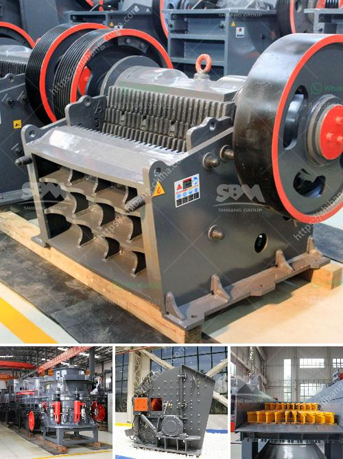

<h3>quarry impact crusher equipment</h3>
With the impact of the COVID-19 pandemic being felt across the globe, the quarrying and mining industries are under pressure to remain operational. To keep pace with the ever-increasing demand for manufactured sand, the quarry impact crusher equipment suppliers are expanding their product range while strengthening existing product lines.

The impact of the impact crusher is primarily realized in the high-speed impact between materials and the counter-attack plate, and the finished products obtained after screening and grading are of uniform particle size and fully meet the production needs.

Due to the relatively high proportion of fine particles, the impact crusher is generally used for crushing limestone, coal, calcium carbide, and other medium-hard and brittle materials with medium hardness. Compared with limestone, the crushed material has a larger particle size and higher hardness, so it needs to be broken in stages. At the same time, it is necessary to avoid the formation of too many stone powder and too wet materials, so as to ensure the quality of the final product.

The quarry impact crusher equipment is equipped with a high-performance impact crusher, with a lightweight and reasonable structure design, superior performance, and excellent quality. When the crusher is operated, the rotor rotates at high speed, with the motor driving. When the material enters the crushing chamber, it impacts and breaks with the plate hammer on the rotor, and then it is thrown to the counterattack device to break again. Finally, it is discharged from the discharge port.

In the production process, in order to achieve better crushing effect, it is necessary to carry out material selection and pretreatment in advance. At the same time, ensure the uniformity of the feeding, avoid too much or too little, and prevent materials larger than the specified size from entering the equipment to avoid damage to the equipment. Additionally, regular maintenance and inspections are crucial to ensure the smooth operation of the equipment and extend its service life.

The quarry impact crusher equipment is ideal for producing high-quality end products that are impact-resistant and well-shaped. It can process materials like limestone, granite, river pebbles, concrete, and other materials with side lengths of less than 500 mm and compressive strength up to 350 MPa. It has a large crushing ratio, high production capacity, and uniform product size.

In conclusion, the quarry impact crusher equipment with a lightweight and reasonable structure design, superior performance, and excellent quality can meet the needs of various applications. It is suitable for all kinds of coarse, medium, and fine materials with a particle size not exceeding 500mm and compressive strength not exceeding 350MPa, such as limestone, river pebble, granite, basalt, and other materials. The final product sizes are adjustable, meeting the specifications of different construction materials. By investing in this equipment, quarry operators can boost their production efficiency and profitability.
<h3>Contact us</h3><ul><li><strong>Whatsapp:&nbsp;<a href="https://wa.me/8613661969651">+8613661969651</a></strong></li><li><a href="https://swt.shibang-china.com/?git&amp;zhl&amp;quarry impact crusher equipment"><strong>Online Service(chat now)</strong></a></li></ul><h3>Related</h3><ul><li><a href='conventional stone crushers in peru.md'>conventional stone crushers in peru</a></li><li><a href='marble ball mill.md'>marble ball mill</a></li><li><a href='quote for stone crusher.md'>quote for stone crusher</a></li><li><a href='mobile crushing plant for sale in africa.md'>mobile crushing plant for sale in africa</a></li><li><a href='crushing machine for sale in nigeria.md'>crushing machine for sale in nigeria</a></li></ul>