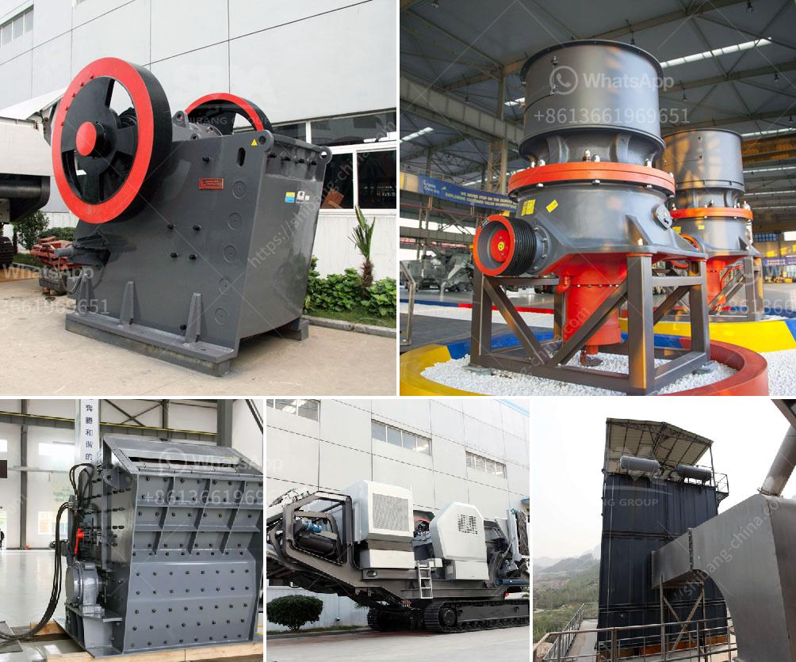

<h3>quarry machine for sale</h3>
Quarrying activities have been carried out for thousands of years and quarrying of natural resources continues to be one of the most important economic activities in modern times. The quarrying industry is highly competitive and constantly evolving. To stay ahead of the competition, quarry owners and operators need to invest in high-quality equipment that increases productivity and efficiency. One such essential equipment for quarrying activities is the quarry machine, effectively designed to handle the tough conditions encountered in the quarry environment.

A quarry machine refers to a machine capable of digging, cutting or blasting rocks and other mineral-rich surfaces in a quarry environment. These machines are usually accompanied by a team of workers known as quarrymen who are responsible for extracting the desired resources. Quarry machines come in a variety of sizes, types, and capacities ranging from large, earth-moving machines used to extract huge quantities of materials to smaller, more portable machines designed for excavating specific minerals or quarries.

One of the key advantages of investing in quarry machines is their ability to increase productivity. With the right machine, quarry operators can extract large quantities of resources in a relatively short amount of time. This allows for faster and more efficient operations, resulting in increased profitability for the quarry owner. Additionally, quarry machines help reduce manual labor, which is not only physically demanding but also time-consuming. By automating certain processes, quarry machines make the overall operation safer and less dependent on human labor.

When looking to purchase a quarry machine, there are several factors that need to be considered. The first and most important factor is the type of material that needs to be extracted. Different machines are designed for specific materials, such as granite, limestone, marble, or sandstone. It is crucial to choose a machine that is specifically designed to handle the type of material found in the quarry to ensure maximum efficiency.

Another crucial factor to consider is the machine's capacity. The capacity of the machine determines the amount of material it can extract within a given timeframe. Depending on the size of the quarry operation and the demand for resources, a machine with a higher capacity may be required. It is important to carefully assess the needs of the quarry before making a purchase.

Furthermore, the reliability and durability of the machine should not be overlooked. Quarry operations can be harsh, with constant exposure to dust, rocks, and extreme weather conditions. Investing in a machine that is built to withstand these conditions ensures that the machine will have a longer lifespan and require minimal maintenance. High-quality machines are often more expensive upfront, but the long-term benefits outweigh the initial investment.

In conclusion, quarry machines are an integral part of any quarrying operation. They offer numerous benefits, including increased productivity, reduced labor costs, and improved safety. When purchasing a quarry machine, it is important to consider the type of material being extracted, the machine's capacity, and its durability. By investing in the right equipment, quarry operators can optimize their operations and stay ahead of the competition.
<h3>Contact us</h3><ul><li><strong>Whatsapp:&nbsp;<a href="https://wa.me/8613661969651">+8613661969651</a></strong></li><li><a href="https://swt.shibang-china.com/?git&amp;zhl&amp;quarry machine for sale"><strong>Online Service(chat now)</strong></a></li></ul><h3>Related</h3><ul><li><a href='crushing machines of compostable material.md'>crushing machines of compostable material</a></li><li><a href='coal roller mill.md'>coal roller mill</a></li><li><a href='ball mill for limestone.md'>ball mill for limestone</a></li><li><a href='cornerstone equipment used rock crushers.md'>cornerstone equipment used rock crushers</a></li><li><a href='mini stone crushing machine.md'>mini stone crushing machine</a></li></ul>