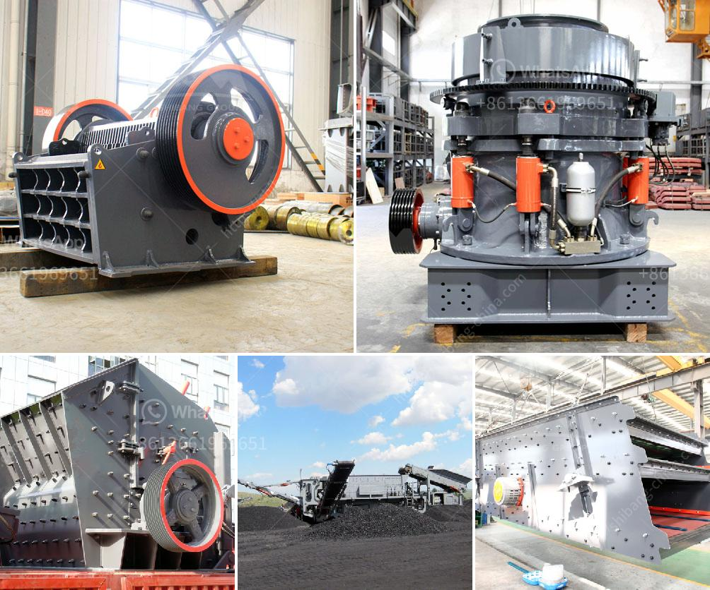

<h3>quarry machines and prices</h3>
Quarry machines, also known as stone crushers, are widely used in the mining and construction industry. They provide crushed stones, sand, and gravel for various purposes ranging from road construction to cement production and landscaping.

Quarry machines derive their power from a powerful engine that enables them to crush rocks and other hard materials with ease. These machines typically consist of a feeder, a primary crusher, a secondary crusher, and a vibrating screen. Each component plays a vital role in the crushing process, ensuring that the end product is of high quality for various applications.

When it comes to prices, quarry machines can range from a few thousand dollars to millions of dollars, depending on the size, capacity, and features of the machine. Smaller machines for personal or small-scale use can be found at a lower price range. These machines usually have a lower output capacity but are suitable for individuals or small businesses operating on a tight budget.

On the other hand, larger quarry machines with higher capacity and advanced features can be quite expensive. These machines are typically used by large mining companies or contractors working on major infrastructure projects. Their higher prices are justified by their ability to crush large quantities of rock and produce a substantial amount of aggregate material in a short period.

It is important to consider not only the initial purchase price but also the operational costs when evaluating quarry machines. Fuel consumption, maintenance, and spare parts should be taken into account to calculate the total cost of ownership. Additionally, warranties, after-sales support, and the reputation of the machine manufacturer should be considered to ensure a reliable and long-lasting investment.

In conclusion, quarry machines are crucial for the mining and construction industry. Prices can vary significantly depending on the size, capacity, and features of the machine. Therefore, thorough research and consideration of operational costs are essential to make an informed decision when purchasing a quarry machine.
<h3>Contact us</h3><ul><li><strong>Whatsapp:&nbsp;<a href="https://wa.me/8613661969651">+8613661969651</a></strong></li><li><a href="https://swt.shibang-china.com/?git&amp;zhl&amp;quarry machines and prices"><strong>Online Service(chat now)</strong></a></li></ul><h3>Related</h3><ul><li><a href='mill ore grind size passing 200 mesh.md'>mill ore grind size passing 200 mesh</a></li><li><a href='silica sand mining process equipment in south africa.md'>silica sand mining process equipment in south africa</a></li><li><a href='crushers for sale in south africa.md'>crushers for sale in south africa</a></li><li><a href='quarry plant for sale.md'>quarry plant for sale</a></li><li><a href='rock crusher machine.md'>rock crusher machine</a></li></ul>