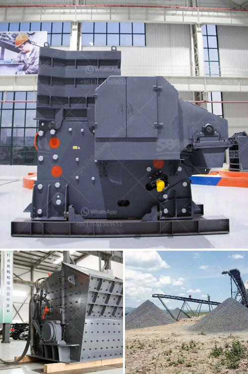

<h3>quarry machines for sale</h3>
Quarries are large opencast or underground mines where stones and minerals are extracted to be used in construction and other industries. To efficiently extract these valuable resources, the use of quarry machines and equipment is essential. Whether it's crushing, screening, or conveying, these machines play a crucial role in the mining and quarrying process.

One of the primary machines used in quarries is the crusher. Crushing machines are used to break down larger rocks into smaller, more manageable sizes. These machines can crush stones, ores, and other materials to produce the desired product size for further processing. Numerous types of crushers are available, such as jaw crushers, cone crushers, impact crushers, and even specialized machines like rock breakers and roll crushers.

In addition to crushers, quarry machines also include screening equipment. Screening machines are used to separate the crushed materials into different sizes or grades, allowing for further processing or to be sold as a specific product. Vibrating screens, trommel screens, and scalping screens are commonly used in quarries to efficiently sort materials based on their particle size.

Conveying systems are another crucial element in quarry operations. These machines transport the extracted materials from one area to another, minimizing the need for manual labor and improving overall efficiency. Belt conveyors, bucket elevators, and screw conveyors are among the commonly used types of conveying systems in quarries.

If you are in the market for quarry machines, there are many options available for sale. From small-scale operations to large-scale mining companies, you can find quarry machines that suit your specific needs. When purchasing these machines, it is essential to consider factors such as the material you will be processing, the desired product size, and the level of automation required. Additionally, ensuring that the machines are of high quality and well-maintained is crucial for optimal performance and longevity.

In conclusion, quarry machines are essential tools for the mining and quarrying industry. They facilitate the extraction, crushing, screening, and conveying of various materials to be utilized in construction and other sectors. When searching for quarry machines for sale, it is vital to consider your specific requirements and ensure you acquire machines that meet your needs efficiently. With the right quarry machines by your side, you can powerfully crush ore, rocks, and more, ultimately boosting productivity and profitability in your operations.
<h3>Contact us</h3><ul><li><strong>Whatsapp:&nbsp;<a href="https://wa.me/8613661969651">+8613661969651</a></strong></li><li><a href="https://swt.shibang-china.com/?git&amp;zhl&amp;quarry machines for sale"><strong>Online Service(chat now)</strong></a></li></ul><h3>Related</h3><ul><li><a href='rock crushers in south africa.md'>rock crushers in south africa</a></li><li><a href='thailand charcoal briquette machine for sale.md'>thailand charcoal briquette machine for sale</a></li><li><a href='granite rock crusher.md'>granite rock crusher</a></li><li><a href='crusher in sale in nepal.md'>crusher in sale in nepal</a></li><li><a href='clay grinding mill machine price in china.md'>clay grinding mill machine price in china</a></li></ul>