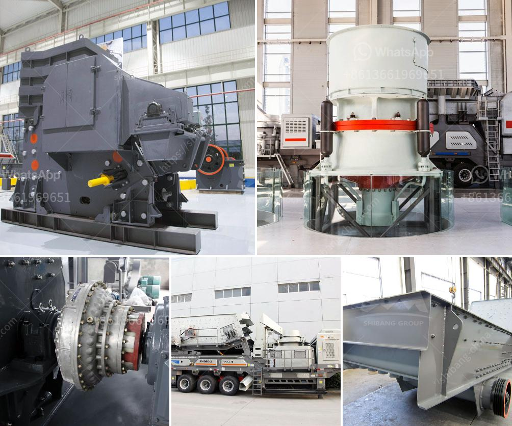

<h3>quarry making machine from south africa</h3>
A quarry is a sizable mining operation designed to extract valuable minerals or other geological materials from the earth. These materials are then used for various purposes such as building structures, roads, bridges, etc. Quarries are an essential part of the mining industry in South Africa, and the machines used to excavate these sites make the process efficient and productive. In recent years, quarry making machines from South Africa have gained considerable popularity due to their reliability, durability, and versatility.

One of the key factors in the success of any quarry operation is the efficiency of the digging and loading processes. Quarry making machines from South Africa are built with advanced technology and innovative design, ensuring smooth and efficient operations on the site. These machines are equipped with powerful engines, capable of handling heavy-duty digging and loading tasks. The robust construction of these machines guarantees their durability even in the most challenging mining environments.

Quarry making machines are specifically designed to break through tough materials, such as rocks, stones, and minerals, making them easier to extract. These machines come equipped with special tools and attachments, such as hydraulic hammers and excavator buckets, which ensure quick and efficient material removal. Their precise control mechanisms allow operators to dig and load materials with precision, reducing waste and increasing productivity.

One of the significant advantages of quarry making machines is their versatility. These machines can be easily adapted to various applications, making them suitable for a wide range of mining operations. They can handle various types of materials, including limestone, granite, slate, sandstone, and more. Additionally, these machines can be used for both surface and underground mining activities, making them a valuable asset for mining companies operating in South Africa.

Safety is a crucial concern in any mining operation, and quarry making machines prioritize the safety of operators and workers on the site. These machines are fitted with advanced safety features, including protective guards, emergency stop buttons, and operator-friendly controls. These features not only protect the operators from potential hazards but also increase the overall efficiency of the quarrying process.

In recent years, South Africa has witnessed significant growth in its mining industry. The demand for quarry making machines has increased as mining companies strive to meet the growing demand for raw materials to support infrastructure development and economic growth. Quarry making machines from South Africa have emerged as a preferred choice due to their exceptional performance, durability, and cost-effectiveness.

In conclusion, quarry making machines from South Africa play a vital role in the mining industry by ensuring efficient and productive operations. Their advanced technology, robust construction, versatility, and safety features make them essential equipment for quarrying activities. As the demand for minerals continues to grow, the reliance on these machines will also increase, further bolstering South Africa's position in the global mining industry.
<h3>Contact us</h3><ul><li><strong>Whatsapp:&nbsp;<a href="https://wa.me/8613661969651">+8613661969651</a></strong></li><li><a href="https://swt.shibang-china.com/?git&amp;zhl&amp;quarry making machine from south africa"><strong>Online Service(chat now)</strong></a></li></ul><h3>Related</h3><ul><li><a href='grinding mill prices in zimbabwe.md'>grinding mill prices in zimbabwe</a></li><li><a href='material composition for coal screen.md'>material composition for coal screen</a></li><li><a href='sri lanka sand washing machine prices.md'>sri lanka sand washing machine prices</a></li><li><a href='price of mobile crusher.md'>price of mobile crusher</a></li><li><a href='aggregate quarry crusher philippines.md'>aggregate quarry crusher philippines</a></li></ul>