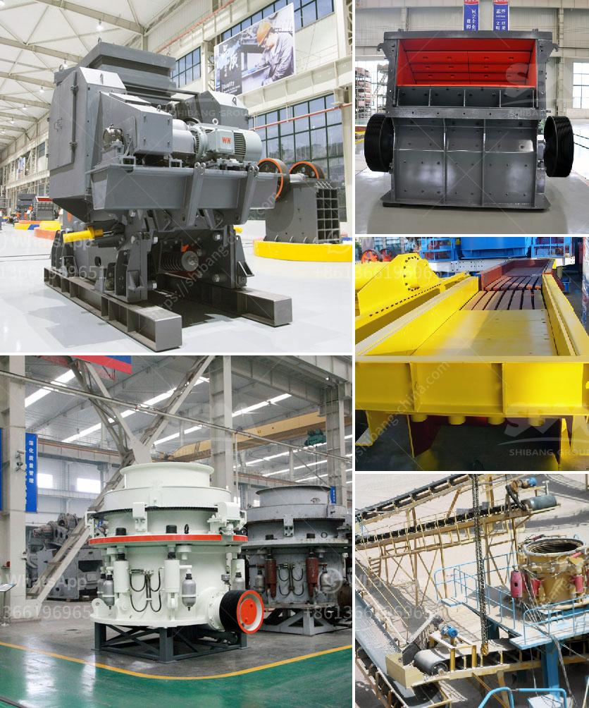

<h3>quarry plant all in one gold mining equipment</h3>
Gold mining is one of the oldest industries in the world and it remains as one of the most lucrative businesses. The process of gold extraction has been evolving with time and has undergone several changes, transforming the way gold is mined. Today, quarry plant all in one gold mining equipment makes the world of gold mining more accessible to the smaller-scale miner, allowing more individuals to participate in gold extraction.

Quarry plant all in one gold mining equipment refers to a complete set of equipment used to extract gold within a quarry setting. This equipment can be used for both placer and hard rock mining, enhancing efficiency in extracting gold. The equipment is ingeniously designed and constructed so that it can be easily transported to operational sites, reducing logistical hurdles that often plague small-scale mining operations.

One of the key features of quarry plant all in one gold mining equipment is its ability to be self-sufficient. This means that the equipment is equipped with all the necessary components to not only extract gold but also to process it on-site. From crushing and grinding the ore to extracting and refining the gold, the equipment can perform all the necessary tasks without the need for additional machinery or outside intervention. This level of self-sufficiency greatly increases the efficiency and profitability of gold mining operations.

Another advantage of the quarry plant all in one gold mining equipment is its versatility. The equipment is designed to handle different types of ore, whether it is placer gold, hard rock gold, or mixed gold-bearing ore. This versatility allows miners to extract gold from various sources without the need for specialized equipment for each type of ore. Consequently, miners can exploit different gold deposits within a single mining operation, maximizing the potential for profit.

Moreover, quarry plant all in one gold mining equipment is equipped with technology that improves gold recovery rates. Traditionally, gold recovery rates have been relatively low due to losses during the extraction and refining processes. However, the advanced technology integrated into the equipment significantly improves these rates, ensuring that more gold is recovered from each ounce of ore processed. This increased recovery rate translates into higher profits for the miners, making gold mining even more appealing.

Furthermore, the compact design of quarry plant all in one gold mining equipment makes it easier to operate and maintain. The equipment is designed to be user-friendly and requires minimal training for operation. Additionally, the equipment is engineered to withstand the harsh conditions often found in mining environments, reducing the need for frequent repairs and replacements. This enhances operational efficiency and lowers costs for the miners.

In conclusion, quarry plant all in one gold mining equipment is a game changer in the mining industry. It opens up opportunities for smaller-scale miners to participate in gold extraction and increases their chances of success. The self-sufficiency, versatility, advanced technology, and user-friendly design of the equipment make gold mining more accessible and profitable. As technology continues to advance, we can expect further improvements in quarry plant all in one gold mining equipment, revolutionizing the way gold is mined in the future.
<h3>Contact us</h3><ul><li><strong>Whatsapp:&nbsp;<a href="https://wa.me/8613661969651">+8613661969651</a></strong></li><li><a href="https://swt.shibang-china.com/?git&amp;zhl&amp;quarry plant all in one gold mining equipment"><strong>Online Service(chat now)</strong></a></li></ul><h3>Related</h3><ul><li><a href='stone crushing plant manufacturer.md'>stone crushing plant manufacturer</a></li><li><a href='granite crushing plant.md'>granite crushing plant</a></li><li><a href='complete crushing plant 150 200t.md'>complete crushing plant 150 200t</a></li><li><a href='nepal crushing crusher.md'>nepal crushing crusher</a></li><li><a href='price of a large mobile crusher.md'>price of a large mobile crusher</a></li></ul>