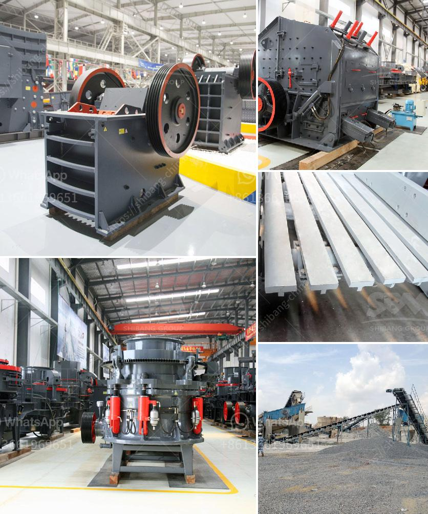

<h3>quarry plant for sale</h3>
The extraction of natural resources has played a pivotal role in the growth of human civilization. Quarries, in particular, have been instrumental in providing stone and minerals for various industries. However, the process of operating a quarry plant can be complex and demanding. That's why when a quarry plant goes up for sale, it presents a unique opportunity for entrepreneurs and businesses looking to tap into this lucrative industry.

A quarry plant consists of various machinery and equipment that facilitate the extraction and processing of natural resources. These plants usually include crushers, screens, conveyor belts, feeders, and other heavy-duty equipment. When a quarry plant is put up for sale, it offers the chance to acquire a fully functional operation with all the necessary infrastructure in place.

One significant advantage of purchasing a quarry plant is the immediate access it provides to valuable resources. With the ever-increasing demand for construction materials, owning a quarry plant guarantees a steady supply of stone, gravel, sand, or minerals for various applications, including road construction, building projects, and infrastructure development.

Not only does a quarry plant offer access to valuable resources, but it also opens doors for diversification and expansion. Once the plant is acquired, it can be optimized to increase production efficiency, reduce costs, and improve the quality of the output. This can lead to increased profits and enable the business to explore new markets and customers. Furthermore, with advancements in technology and sustainability practices, a new owner can implement eco-friendly solutions and create a more sustainable quarry operation.

Investing in a quarry plant requires careful consideration and due diligence. Factors such as the location, geological resources, market demand, and operational costs should be thoroughly assessed before making a decision. Consulting with industry professionals and conducting a comprehensive feasibility study is crucial to ensure a successful venture.

In conclusion, the sale of a quarry plant is an exciting opportunity for entrepreneurs and businesses looking to enter or expand their presence in the extractive industry. Owning a quarry plant not only provides access to valuable resources but also allows for diversification and growth. However, proper planning and research are essential to fully exploit the hidden potential of a quarry plant. With the right strategy, ownership of a quarry plant can be a stepping stone to unlocking a world of opportunities.
<h3>Contact us</h3><ul><li><strong>Whatsapp:&nbsp;<a href="https://wa.me/8613661969651">+8613661969651</a></strong></li><li><a href="https://swt.shibang-china.com/?git&amp;zhl&amp;quarry plant for sale"><strong>Online Service(chat now)</strong></a></li></ul><h3>Related</h3><ul><li><a href='gold mining machine from germany.md'>gold mining machine from germany</a></li><li><a href='micron grinding manufacturer.md'>micron grinding manufacturer</a></li><li><a href='lime dolomite plant processing.md'>lime dolomite plant processing</a></li><li><a href='stone crusher machine manufacturer in india.md'>stone crusher machine manufacturer in india</a></li><li><a href='pulverizer crusher machine for coal.md'>pulverizer crusher machine for coal</a></li></ul>