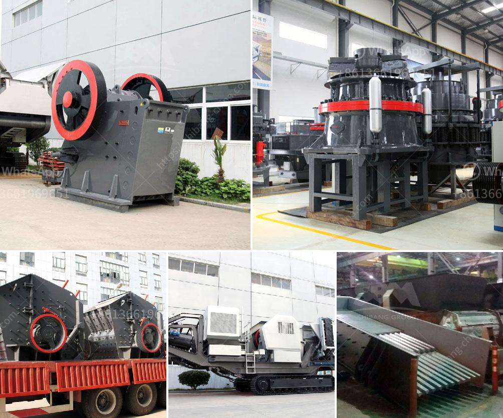

<h3>quarry processing plant</h3>
A quarry processing plant is a facility where various aggregate materials are extracted, crushed, screened, and processed to produce different sizes of high-quality aggregates and other stone products. These aggregates are used in the construction industry for building roads, bridges, highways, and other infrastructure projects.

The process of quarrying begins with the drilling and blasting of rock formations deep within the earth's surface. This process breaks the rock into smaller pieces that can be easily transported to the processing plant. Once at the plant, the raw materials are fed into a crusher to break them down further into smaller sizes.

After the initial crushing, the materials are then screened to separate the different sizes of aggregates. This is important because different construction projects require different sizes of aggregates. Oversized materials are sent back for further crushing, while properly sized aggregates are sent to stockpiles for storage and sale.

In addition to crushing and screening, a quarry processing plant also includes other processes such as washing, sorting, and sometimes blending. Washing is used to remove any impurities or unwanted materials from the aggregates, ensuring that the final product meets the required specifications. Sorting is done to separate different types of aggregates based on their size, shape, or color. Blending, on the other hand, is done to create custom mixes of aggregates to meet specific project requirements.

A well-designed quarry processing plant is essential for efficient and cost-effective production of high-quality aggregates. It should be equipped with modern and reliable machinery, such as crushers, screens, and conveyors, to ensure smooth operations. Proper maintenance and regular inspections are also necessary to ensure the plant operates at its full capacity and to prevent breakdowns or delays in production.

In conclusion, a quarry processing plant is a vital facility in the construction industry that plays a crucial role in producing the aggregates needed for various infrastructure projects. From drilling and blasting to crushing, screening, and other processes, the plant ensures the production of high-quality materials that meet the required specifications. A well-maintained and efficient plant is key to meeting the demands of the construction industry and ensuring the successful completion of projects.
<h3>Contact us</h3><ul><li><strong>Whatsapp:&nbsp;<a href="https://wa.me/8613661969651">+8613661969651</a></strong></li><li><a href="https://swt.shibang-china.com/?git&amp;zhl&amp;quarry processing plant"><strong>Online Service(chat now)</strong></a></li></ul><h3>Related</h3><ul><li><a href='jaw crushers prices in zimbabwe.md'>jaw crushers prices in zimbabwe</a></li><li><a href='clinker production process.md'>clinker production process</a></li><li><a href='used portable stone crushers for sale ontario.md'>used portable stone crushers for sale ontario</a></li><li><a href='coal washing plant drawing.md'>coal washing plant drawing</a></li><li><a href='jaw crusher for 100x200.md'>jaw crusher for 100x200</a></li></ul>