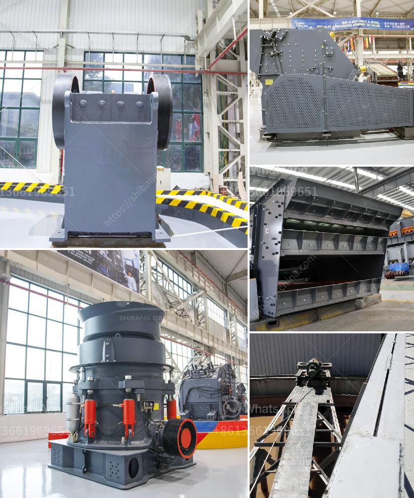

<h3>quartz crusher machine</h3>
Quartz is a mineral that can be found in many rocks around the world. It is typically used in manufacturing and construction due to its durability and abundance. However, processing quartz can be somewhat challenging since it is extremely hard and requires specialized equipment to crush it into smaller pieces.

One such machine that is used to crush quartz is the quartz crusher machine. This machine operates on a simple mechanism and requires minimal maintenance. It consists of a robust outer frame, which houses a crushing chamber and an adjustable eccentric drive shaft. The crushing chamber is lined with hardened manganese steel to withstand the high impact forces generated during the crushing process.

The quartz crusher machine works by applying a compressive force to the material being crushed. This force is achieved by the two jaws of the crusher, one stationary and the other movable. The movable jaw exerts force on the rock by pressing it against the stationary jaw, causing it to break into smaller pieces. The size reduction is achieved gradually as the material moves down through the crushing chamber.

The adjustable eccentric drive shaft allows the operator to control the size of the output material. By adjusting the distance between the two jaws, the operator can vary the size of the crushed quartz to meet specific requirements. This versatility makes the quartz crusher machine an ideal choice for various applications in different industries.

One of the key advantages of using a quartz crusher machine is its ability to crush the material into uniform sizes. This is especially important in industries such as construction and manufacturing, where uniformity is essential for the quality of the end product. By producing consistent size particles, the machine ensures that the quartz can be used efficiently and effectively in various applications.

Another advantage of the quartz crusher machine is its low operating costs. The machine is designed to consume less energy and require fewer repairs, reducing the overall maintenance and operational expenses. This makes the quartz crusher machine a cost-effective solution for businesses and industries that require a reliable and efficient crushing machine.

In addition to these advantages, the quartz crusher machine is also environmentally friendly. It operates quietly, producing minimal noise and vibrations. Moreover, it emits no harmful gases or pollutants during the crushing process. This makes it a sustainable choice for businesses that prioritize environmental responsibility.

In conclusion, the quartz crusher machine is an essential equipment in the mining and construction industry. Its durability, efficiency, and cost-effectiveness make it an ideal choice for crushing quartz rocks into smaller pieces. With its powerful crushing mechanism and adjustable output size, the machine offers versatility and high performance. Moreover, its low operating costs and environmental friendliness make it a sustainable choice for businesses. Overall, the quartz crusher machine is a reliable and efficient solution for processing quartz and achieving desired outcomes.
<h3>Contact us</h3><ul><li><strong>Whatsapp:&nbsp;<a href="https://wa.me/8613661969651">+8613661969651</a></strong></li><li><a href="https://swt.shibang-china.com/?git&amp;zhl&amp;quartz crusher machine"><strong>Online Service(chat now)</strong></a></li></ul><h3>Related</h3><ul><li><a href='ball mill for starch damage.md'>ball mill for starch damage</a></li><li><a href='silica powder making machinery in haiti.md'>silica powder making machinery in haiti</a></li><li><a href='aggregate crusher supplier.md'>aggregate crusher supplier</a></li><li><a href='calcium carbide manufacturing plant.md'>calcium carbide manufacturing plant</a></li><li><a href='belt cost conveyor.md'>belt cost conveyor</a></li></ul>