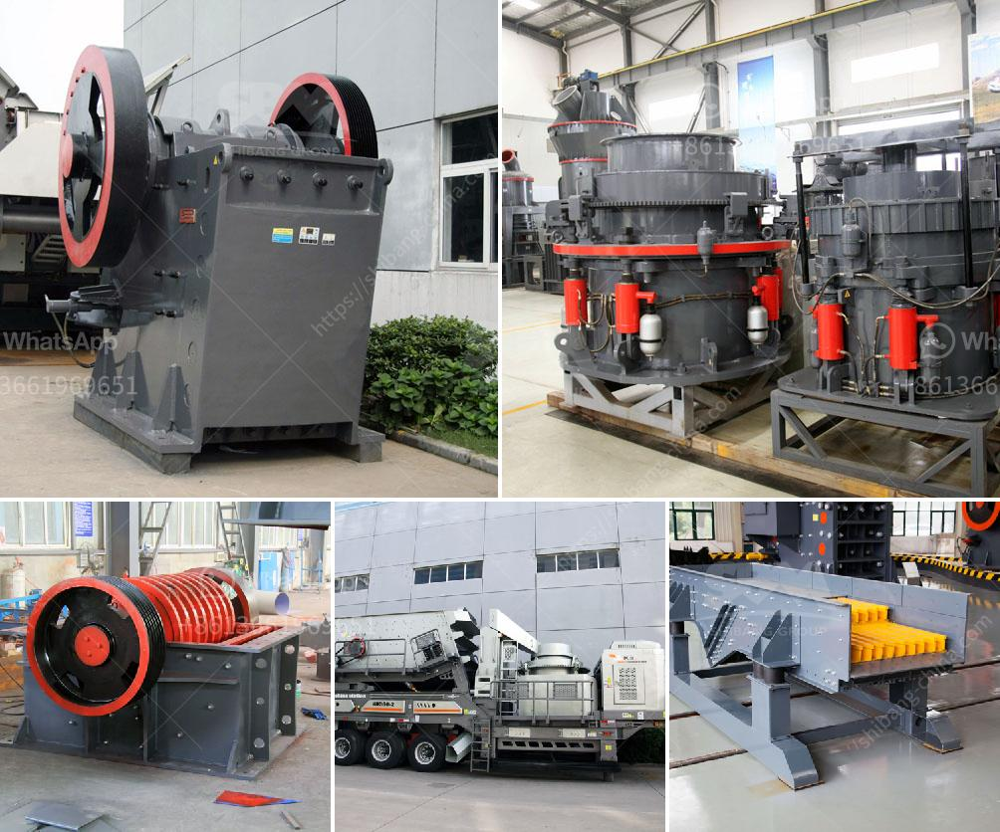

<h3>quartz crusher plant</h3>
Quartz crushing plant, or quartz stone crushing plant, is used for crushing quartz stone," a non-metallic mineral, twice <comma> and breaking the crushed quartz stone with hubei type crusher," a reduction ratio of 4-6. 

Why do we talk about quartz crusher plant? Because quartz is a relatively hard material, and quartz has a high crushing hardness <semicolon> in the mine and on the earth's surface, quartz is widely distributed, with quartz stones

crushed into different sizes <semicolon> generally with <a> which are mainly used <for> construction and <th> other industries <period> Quartz is a mineral resource with stable physical and chemical properties <period> Quartz is not easily affected by external environmental factors <comma> and it <does not> have any potential hazard to the human body <period>

Quartz crusher plant is a necessary piece of machinery in the mining industry <period> As a leading manufacturer and supplier of large-scale crushing equipment <comma> Fote Machinery has made countless efforts in introducing advanced technologies <comma> designing specialized crushing equipment <comma> and analysing materials to provide customers with high-quality products <period> The quartz crushing plant designed by our company has been recognized by customers from all over the world and has been highly evaluated by local companies <period>

Our quartz crusher plant not only has various crushing capacity <comma> but also plays an important role in aggregate processing <period> It grinds quartz stones into different sizes <comma> and processes tailored products for various production purposes <period> Crushing and grinding quartz processing plant plays a significant role in ensuring the overall quality of the final product <period> The quartz sand production line equipment <whether> it is jaw crusher or impact crusher <comma> is used for primary crushing <comma> or fine crushing <comma> and then through the vibrating screen <period> These processes are made in many cases to obtain a better mechanical jaw crusher or impact crusher <period>

In addition to crushers, there are other auxiliary equipment such as feeders and screens <comma> which play a crucial role in the specific process <period> Our company provides a comprehensive range of quartz crusher plant equipment <comma> such as vibrating feeder, jaw crusher, impact crusher, cone crusher, belt conveyor, vibrating screen and mobile crusher <period>

Besides, we also provide more professional and personalized solutions to our customers, including installation and after-sales service <period> Our engineers are available for on-site guidance and installation <period> In case of any problems, we will respond to the customer's request within 24 hours and provide a suitable solution as soon as possible <period>

In conclusion, our quartz crusher plant is an ideal choice for the mining industry <period> With its reliable performance, high crushing ratio, and cost-effective benefits <comma> it has been well received by customers worldwide <period> We believe that our professional and personalized services will bring you great benefits and create a win-win situation <period> Contact us today and let our quartz crusher plant unlock the potential of your mining operation <period>
<h3>Contact us</h3><ul><li><strong>Whatsapp:&nbsp;<a href="https://wa.me/8613661969651">+8613661969651</a></strong></li><li><a href="https://swt.shibang-china.com/?git&amp;zhl&amp;quartz crusher plant"><strong>Online Service(chat now)</strong></a></li></ul><h3>Related</h3><ul><li><a href='copper factory layout design.md'>copper factory layout design</a></li><li><a href='used raymond mill for sale in taiwan crusher.md'>used raymond mill for sale in taiwan crusher</a></li><li><a href='complete crushing plant 150 200t.md'>complete crushing plant 150 200t</a></li><li><a href='gypsum powder factory feasibility study.md'>gypsum powder factory feasibility study</a></li><li><a href='mobile crushers saudi.md'>mobile crushers saudi</a></li></ul>