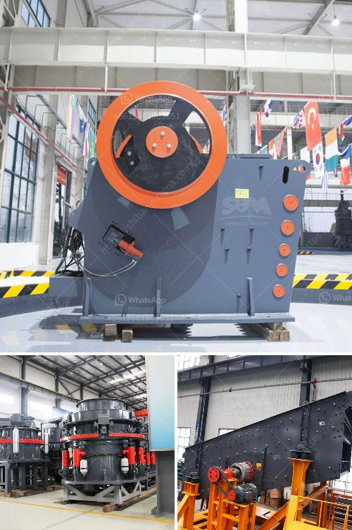

<h3>quartz crushing plant german tecnology</h3>
Quartz is an abundant mineral found in the Earth's crust. It has a unique crystalline structure and is known for its various industrial applications. To utilize these applications efficiently, a quartz crushing plant is required. This plant uses German technology to crush and grind quartz to produce high-quality sand and silicate materials.

The German technology used in quartz crushing plant enables an effective control of the particle size, improving the product quality and discharging characteristics. This not only ensures that the final product meets the required specifications but also maximizes the production yield. With a consistent particle size, the quartz materials can be used in various industries, such as glass manufacturing, construction, and electronics.

One of the key features of the German technology used in the quartz crushing plant is its ability to handle high volumes of material. This ensures that the plant operates efficiently, meeting the demand for quartz materials without any slowdowns or disruptions. Additionally, the technology allows for easy maintenance and servicing of the plant, minimizing downtime and ensuring consistent production.

Furthermore, the German technology used in the quartz crushing plant ensures environmental sustainability. The plant is equipped with advanced dust suppression and noise reduction systems, keeping the workplace safe and minimizing the impact on the surroundings. This technology also enables energy-efficient operation, reducing electricity consumption and contributing to a greener future.

In conclusion, the quartz crushing plant with German technology is a testament to human innovation and technological advancements. It not only enables the efficient production of high-quality quartz materials but also contributes to a sustainable and environmentally friendly future. With its ability to handle high volumes of material and its easy maintenance features, this plant is a valuable asset for industries relying on quartz for their manufacturing processes.
<h3>Contact us</h3><ul><li><strong>Whatsapp:&nbsp;<a href="https://wa.me/8613661969651">+8613661969651</a></strong></li><li><a href="https://swt.shibang-china.com/?git&amp;zhl&amp;quartz crushing plant german tecnology"><strong>Online Service(chat now)</strong></a></li></ul><h3>Related</h3><ul><li><a href='rock stone crusher.md'>rock stone crusher</a></li><li><a href='ball mill operation and maintenance manual pdf.md'>ball mill operation and maintenance manual pdf</a></li><li><a href='granite crushing plants.md'>granite crushing plants</a></li><li><a href='sell old stone crusher.md'>sell old stone crusher</a></li><li><a href='list of equipments needed to start gold mining.md'>list of equipments needed to start gold mining</a></li></ul>