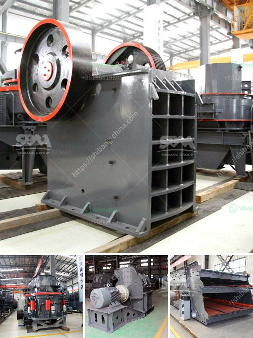

<h3>quartz grinding ball mill</h3>
Quartz grinding ball mill is a grinding device for grinding quartz materials. The material to be ground is fed into the cylinder of the quartz grinding ball mill. The cylinder is filled with grinding media (ceramic balls or steel balls). The mixture of materials and grinding media rotates around its axis, creating friction and grinding the material. The ground material is discharged through a discharge grate.

Quartz is a mineral that is often used in various industries, including engineering, construction, glass, ceramics, and many others. Its abundance and properties make it a valuable material for different applications. However, raw quartz often needs to be ground into a fine powder before it can be used in various processes.

One of the most efficient ways to grind quartz is using a quartz grinding ball mill. It is an important equipment to grind quartz materials into powder. Researchers have been studying grinding methods for quartz for many years. The traditional grinding methods for quartz include dry and wet grinding. However, dry grinding often produces a lot of dust, which is harmful to workers' health and affects product quality. Wet grinding, on the other hand, requires a large amount of water, which can lead to high costs and environmental issues.

The quartz grinding ball mill overcomes these problems. Its unique design and operation provide a clean and efficient grinding solution without the need for water or any other additives. The grinding media inside the ball mill use high-quality ceramic or steel balls that mix and crush the quartz materials with impact force.

The cylinder of the quartz grinding ball mill rotates at a certain speed. As the cylinder rotates, the grinding media cascade and fall freely, causing the materials inside the cylinder to be ground. The grinding process is energy-efficient and produces small particle sizes. The size of the ground quartz powder can be controlled by adjusting the grinding media and the operating parameters of the ball mill.

The quartz grinding ball mill has a compact and simple structure, which makes it easy to maintain and operate. It requires low energy consumption and has a high grinding efficiency. The grinding process is stable and reliable, ensuring the quality of the ground quartz powder.

In conclusion, the quartz grinding ball mill is an efficient grinding device for grinding quartz materials. It is suitable for both dry and wet grinding processes, making it a versatile and energy-efficient solution for various industries. With its compact structure and low maintenance requirements, it is an ideal choice for grinding quartz materials into fine powder. Whether for engineering, construction, or other applications, the quartz grinding ball mill offers precise grinding and reliable performance.
<h3>Contact us</h3><ul><li><strong>Whatsapp:&nbsp;<a href="https://wa.me/8613661969651">+8613661969651</a></strong></li><li><a href="https://swt.shibang-china.com/?git&amp;zhl&amp;quartz grinding ball mill"><strong>Online Service(chat now)</strong></a></li></ul><h3>Related</h3><ul><li><a href='part of hammer mill.md'>part of hammer mill</a></li><li><a href='slag crushing machine hopper in india.md'>slag crushing machine hopper in india</a></li><li><a href='vibrator screen for coal.md'>vibrator screen for coal</a></li><li><a href='big slage crusher mechins plant.md'>big slage crusher mechins plant</a></li><li><a href='processing plants from china.md'>processing plants from china</a></li></ul>