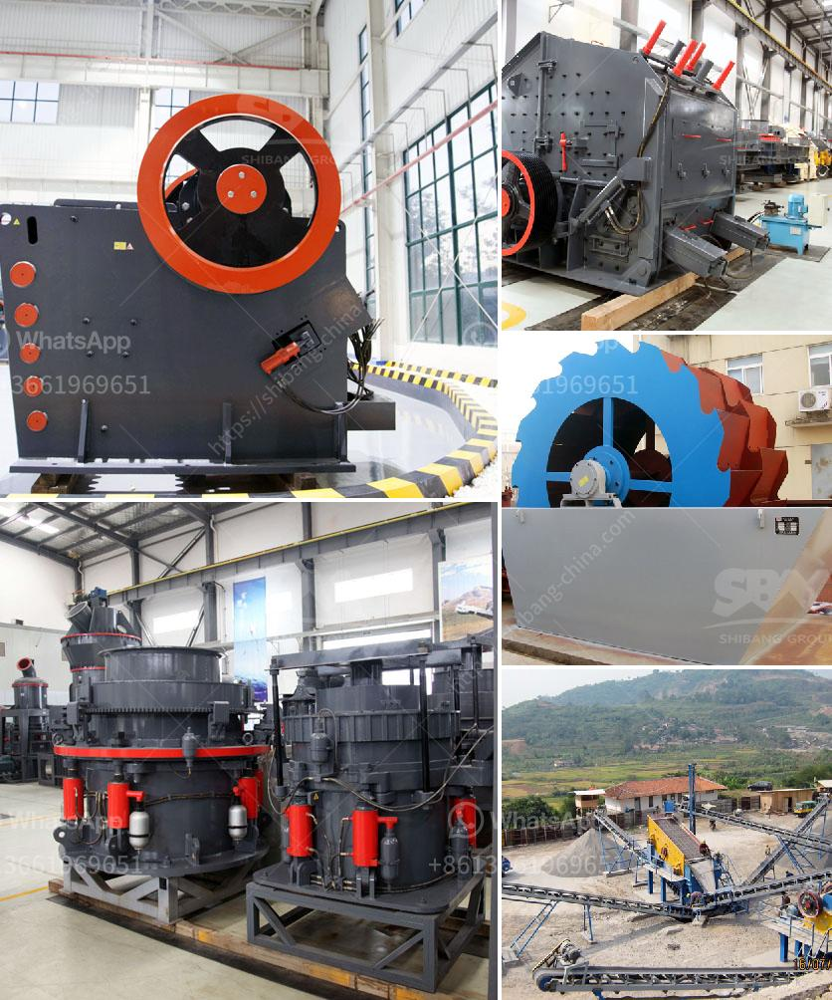

<h3>quartz grits plant consultancy</h3>
In the fast-growing industrial sector, the demand for quartz grits has been skyrocketing. Quartz grits, also known as quartz powder or silica sand, plays a vital role in various industries like construction, glass manufacturing, ceramics, and more. As a result, the establishment of a quartz grits plant has become a lucrative business opportunity.

However, starting a quartz grits plant requires a deep understanding of the entire process, from initial planning to installation and operation. This is where quartz grits plant consultancy services come into play. These specialized consultation firms provide comprehensive guidance and support to entrepreneurs and investors looking to venture into the quartz grits industry.

Quartz grits plant consultancy offers a range of services that cover various aspects of setting up and running a successful plant. For instance, they assist in identifying the ideal plant location, considering factors such as raw material availability, transportation logistics, and proximity to target markets. Moreover, these consultants provide valuable insights into the procurement of machinery, equipment, and troubleshooting common operational issues.

Furthermore, quartz grits plant consultancy services also guide investors through the legal and regulatory requirements of establishing a plant. They offer assistance in obtaining licenses, permits, and environmental clearances, ensuring that the entire process is compliant with local regulations.

The benefits of engaging with a quartz grits plant consultancy are significant. Firstly, the consultants' expertise and experience can save investors valuable time and resources, as they have already explored the nuances of the industry. Additionally, their market insights can help optimize production processes and improve the overall operational efficiency of the plant.

In conclusion, quartz grits plant consultancy services offer a strategic advantage when venturing into the quartz grits industry. Their expertise, guidance, and support can help entrepreneurs establish and operate a successful quartz grits plant. With the growing demand for quartz grits, partnering with a consultancy firm can take your business to new heights.
<h3>Contact us</h3><ul><li><strong>Whatsapp:&nbsp;<a href="https://wa.me/8613661969651">+8613661969651</a></strong></li><li><a href="https://swt.shibang-china.com/?git&amp;zhl&amp;quartz grits plant consultancy"><strong>Online Service(chat now)</strong></a></li></ul><h3>Related</h3><ul><li><a href='raymond mill supplier.md'>raymond mill supplier</a></li><li><a href='china granite crusher.md'>china granite crusher</a></li><li><a href='crusher machine plant.md'>crusher machine plant</a></li><li><a href='process of preparation of coal and asha.md'>process of preparation of coal and asha</a></li><li><a href='mobile rock pulverizer grizzly feeder.md'>mobile rock pulverizer grizzly feeder</a></li></ul>