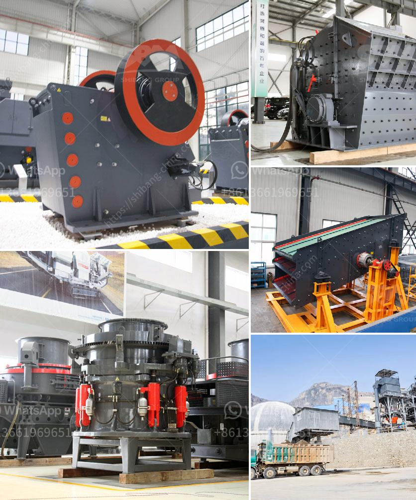

<h3>quartz manufacturing plant in tamilnadu</h3>
Quartz is a versatile and durable mineral used in various industries, including construction, electronics, and telecommunications. Tamil Nadu, blessed with an abundant quartz reserve, has witnessed the development of numerous quartz manufacturing plants. These plants have not only boosted the state's economy but also spearheaded technological advancements and job creation.

Tamil Nadu has long been recognized for its mineral-rich landscape. The state's quartz reserves, located primarily in Salem and Dharmapuri districts, have attracted the attention of industrial entrepreneurs. Over the years, several manufacturing plants have been established in the region to capitalize on this natural resource.

1. Economic Growth: The establishment of quartz manufacturing plants has significantly contributed to the economic growth of Tamil Nadu. The export of quartz products has increased, generating substantial revenue for the state. This growth has resulted in improved infrastructure, increased employment opportunities, and enhanced living standards.

2. Technological Advancements: Quartz manufacturing plants in Tamil Nadu have brought forth technological advancements in the industry. These plants utilize state-of-the-art machinery and equipment to process and refine quartz into various forms, such as quartz powder, quartz slabs, and quartz crystals. This cutting-edge technology has not only improved production efficiency but also enhanced the quality of the final products.

3. Job Creation: The establishment of quartz manufacturing plants has generated employment opportunities for the local population. These plants hire skilled and unskilled workers, providing them with stable jobs and a regular income. Additionally, numerous ancillary industries have emerged around these plants, further contributing to job creation and economic prosperity.

While the growth of quartz manufacturing plants has undeniably benefitted the state's economy, it is crucial to address the potential environmental impact. Quartz extraction and processing can result in soil erosion, water pollution, and habitat destruction. However, responsible mining practices and effective waste management techniques can mitigate these concerns. Regulatory authorities and plant operators must prioritize environmental sustainability by adhering to stringent guidelines and investing in sustainable practices.

To foster the growth of quartz manufacturing plants, the Tamil Nadu government has extended its support by providing various incentives and offering a conducive business environment. Financial assistance, subsidies, and tax benefits are provided to manufacturers to encourage investment and ensure the sustainability of these plants. The government also plays a crucial role in monitoring and regulating operations to maintain environmental sustainability and worker safety.

The emergence of quartz manufacturing plants in Tamil Nadu has revolutionized the state's industrial landscape. These plants have not only boosted the economy but also acted as catalysts for technological advancements and job creation. However, it is essential to strike a balance between economic growth and environmental conservation. By implementing responsible mining practices and embracing sustainable technologies, the quartz manufacturing industry in Tamil Nadu can continue to thrive while ensuring the preservation of its invaluable natural resources.
<h3>Contact us</h3><ul><li><strong>Whatsapp:&nbsp;<a href="https://wa.me/8613661969651">+8613661969651</a></strong></li><li><a href="https://swt.shibang-china.com/?git&amp;zhl&amp;quartz manufacturing plant in tamilnadu"><strong>Online Service(chat now)</strong></a></li></ul><h3>Related</h3><ul><li><a href='used stone crushers for ballast sale.md'>used stone crushers for ballast sale</a></li><li><a href='bentonite clay crusher for sale.md'>bentonite clay crusher for sale</a></li><li><a href='impact crusher 500tph spcfication.md'>impact crusher 500tph spcfication</a></li><li><a href='granite quarrying and processing firm in kaduna.md'>granite quarrying and processing firm in kaduna</a></li><li><a href='mobile crusher datasheet.md'>mobile crusher datasheet</a></li></ul>