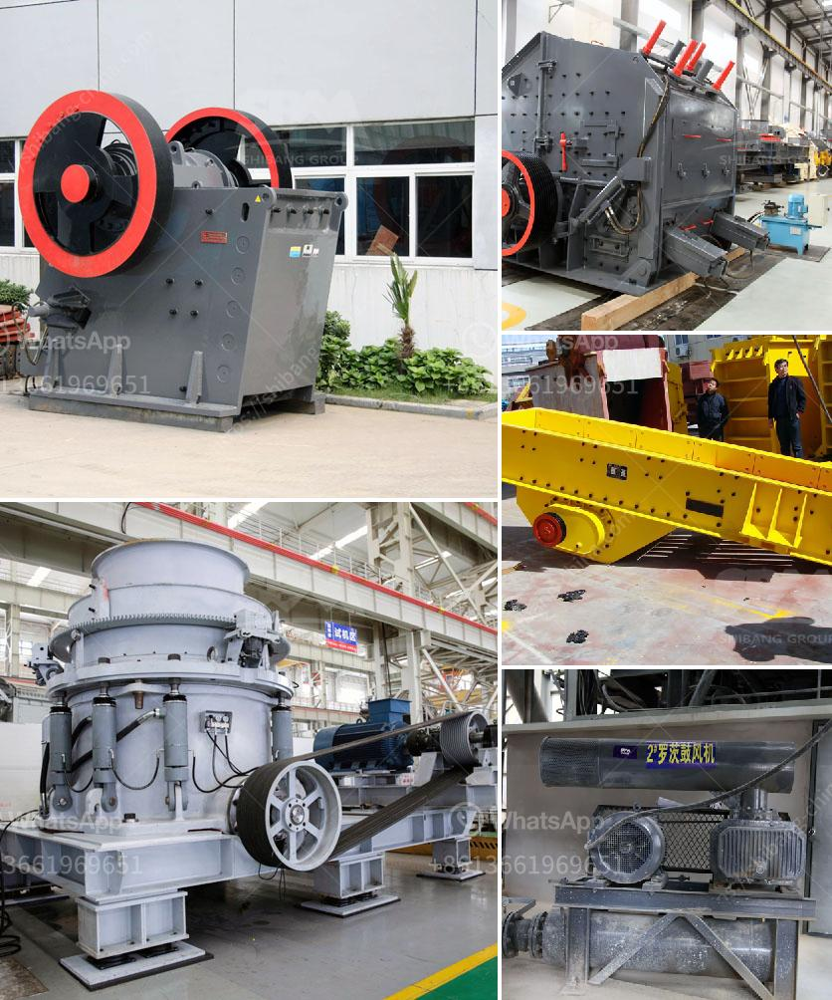

<h3>quartz manufacturing plant</h3>
In recent years, the popularity of quartz has skyrocketed, becoming a preferred choice for countertops, flooring, and various other surfaces in both residential and commercial settings. The reasons behind this surge in demand are its unparalleled durability, stunning aesthetics, and low maintenance properties. To meet this increasing market need, the establishment of quartz manufacturing plants has become imperative. These state-of-the-art facilities, equipped with cutting-edge technology, are revolutionizing the industry by delivering high-quality quartz products that are transforming the way we design and build.

One such quartz manufacturing plant, located in the heart of a thriving industrial zone, has been making significant strides in this dynamic industry. With its massive 50,000 square foot facility, this plant boasts an impressive production capacity, enabling it to meet escalating market demands. The advanced infrastructure and meticulously designed layout ensure efficient workflow and seamless operations.

At the core of this manufacturing plant are the technologically advanced machinery and equipment that truly set it apart. The plant has embraced automation and robotics to elevate production efficiency and precision. Sophisticated cutting machines utilize computer-aided design (CAD) technology to precisely shape and size quartz slabs with minimal waste. These machines, coupled with automated polishing lines, achieve impeccable finishes that showcase the beauty of quartz in its purest form.

In addition to cutting and polishing, the manufacturing process heavily relies on advanced mixing and blending systems. Proprietary techniques and equipment ensure the accurate ratio of raw materials, such as quartz and resins, resulting in superior quality products. The plant has incorporated automated batching systems that precisely measure and mix the constituents, eliminating human error and ensuring consistency and uniformity in every batch.

To further enhance productivity, this quartz manufacturing plant has forged strategic partnerships with leading material suppliers. These collaborations allow for a steady supply of high-quality raw materials, ensuring consistent production. The plant’s stringent quality control measures guarantee that only the best materials are used, resulting in products that meet and exceed industry standards.

The commitment to sustainability is also evident in every aspect of the plant's operation. From energy-efficient machinery to water recycling and waste reduction programs, the manufacturing processes prioritize minimizing environmental impact. To this end, the facility has embraced eco-friendly practices that reduce carbon footprint and promote a greener future for the industry.

Ultimately, the success of this quartz manufacturing plant can be attributed to the passion and expertise of its highly skilled workforce. Trained by industry experts, the plant’s employees bring a wealth of knowledge and dedication to their craft. This, coupled with their constant pursuit of excellence and attention to detail, ensures the production of exceptional quartz products that captivate customers and exceed expectations.

As the demand for quartz continues to rise, the role of quartz manufacturing plants becomes increasingly significant. Their ability to deliver high-quality, durable, and visually stunning quartz products is reshaping the industry. With investments in cutting-edge technology, streamlined processes, and a commitment to sustainability, these plants are at the forefront of innovation, setting new benchmarks for the future of quartz manufacturing.
<h3>Contact us</h3><ul><li><strong>Whatsapp:&nbsp;<a href="https://wa.me/8613661969651">+8613661969651</a></strong></li><li><a href="https://swt.shibang-china.com/?git&amp;zhl&amp;quartz manufacturing plant"><strong>Online Service(chat now)</strong></a></li></ul><h3>Related</h3><ul><li><a href='for selection of coal mill.md'>for selection of coal mill</a></li><li><a href='kobe vertical mill for slag grinding.md'>kobe vertical mill for slag grinding</a></li><li><a href='mobile jaw crusher plant.md'>mobile jaw crusher plant</a></li><li><a href='second hand german jaw crusher for sale.md'>second hand german jaw crusher for sale</a></li><li><a href='biggest crucher in kenya.md'>biggest crucher in kenya</a></li></ul>