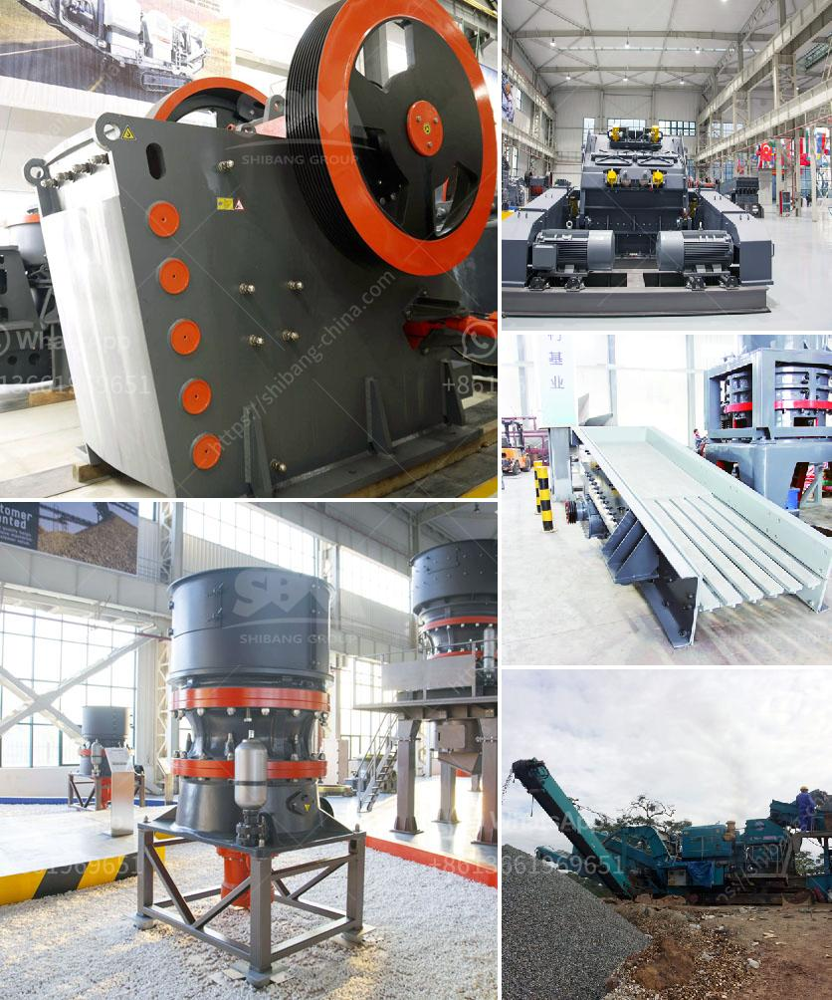

<h3>quartz mining process in andhra pradesh types prices</h3>
Quartz is a highly abundant mineral found in various parts of the world. It is primarily composed of silicon dioxide, making it one of the hardest and most durable minerals. Quartz is extensively used in various industries due to its versatile properties and aesthetic appeal. Andhra Pradesh, a southern state in India, is known for its rich quartz deposits.

The process of quartz mining in Andhra Pradesh involves several steps, beginning with the identification of a potential quartz deposit. After the initial geological survey is conducted, exploration work is undertaken in the identified area. This involves drilling holes to collect samples and analyzing them to determine the quality and quantity of quartz present.

Once a viable deposit is confirmed, the extraction process begins. Quartz mining in Andhra Pradesh is typically done using open-pit or quarrying methods. The quartz veins and mineralized formations are exposed using explosives or mechanical excavation techniques. The extracted quartz is then transported to a processing plant for further refinement.

At the processing plant, the quartz undergoes various processes to achieve the desired quality and purity. This includes crushing the quartz into smaller pieces to facilitate processing. Depending on the end-use, the quartz may be further treated through grinding, washing, or magnetic separation to achieve the desired specifications.

In Andhra Pradesh, quartz is available in various grades, each having its own specific applications. The color, composition, and clarity of the quartz determine its grade. The most common grades of quartz found in Andhra Pradesh include milky white quartz, rose quartz, yellow quartz, and smoky quartz.

The prices of quartz in Andhra Pradesh vary based on these grades. Milky white quartz, known for its clarity and color, is highly sought after and therefore commands a higher price. Rose quartz, with its distinctive pink hue, is also valued for its ornamental purposes but typically has a lower price compared to milky white quartz. Yellow quartz, which is primarily used in the glass industry, and smoky quartz, known for its smoky brown color, are relatively more affordable due to their industrial applications.

The prices of quartz are also influenced by factors such as market demand, availability, and transportation costs. The mining and processing expenses incurred by the miners also impact the final price of quartz. As a result, the prices of quartz in Andhra Pradesh can vary significantly.

Quartz mining in Andhra Pradesh is a lucrative business opportunity due to the high demand for quartz in various industries, including construction, glass making, electronics, and jewelry. The state's abundant quartz deposits and favorable mining policies make it an ideal location for quartz mining and processing operations.

In conclusion, quartz mining in Andhra Pradesh involves the identification of potential deposits, extraction through open-pit or quarrying methods, and further processing to achieve the desired quality and purity. The prices of quartz in Andhra Pradesh vary based on the grade, with milky white and rose quartz typically commanding higher prices. The state's rich quartz deposits and favorable mining policies make it a lucrative business opportunity in the quartz industry.
<h3>Contact us</h3><ul><li><strong>Whatsapp:&nbsp;<a href="https://wa.me/8613661969651">+8613661969651</a></strong></li><li><a href="https://swt.shibang-china.com/?git&amp;zhl&amp;quartz mining process in andhra pradesh types prices"><strong>Online Service(chat now)</strong></a></li></ul><h3>Related</h3><ul><li><a href='used stone crusher ontario.md'>used stone crusher ontario</a></li><li><a href='business proposal preparation for mobile crusher.md'>business proposal preparation for mobile crusher</a></li><li><a href='coal mining machines in south africa.md'>coal mining machines in south africa</a></li><li><a href='crusher machine 200 ton per hours.md'>crusher machine 200 ton per hours</a></li><li><a href='limestone powder making machine india.md'>limestone powder making machine india</a></li></ul>