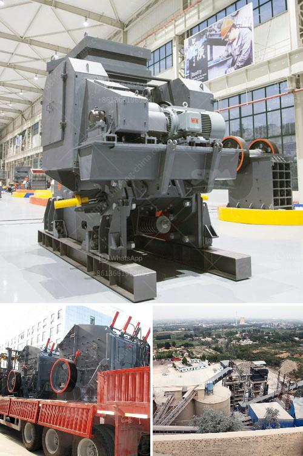

<h3>quartz powder in ball mill</h3>
Quartz powder has wide applications. It is used in various industries such as glass, ceramics, paints, and more. The grinding process of quartz powder in a ball mill requires high precision, and the power consumption of the ball mill is relatively high.

Quartz powder is a common type of silica powder, and its main component is silicon dioxide. Quartz sand is made by crushing quartz fragments into small particles and then ground into a powder. The quartz powder produced by the ball mill has high purity, fine particle size, and uniform particle size distribution. The material can be used for various industries, such as glass, ceramics, and paint.

The ball mill is a cylindrical device used to grind or mix materials like ores, chemicals, ceramic raw materials, and paints. It rotates around a horizontal axis and is partially filled with the material to be ground, plus the grinding medium. Different materials are used as media, including ceramic balls, flint pebbles, and stainless steel balls. When the ball mill rotates, the grinding media and materials will grind each other, resulting in the production of fine particles and a uniform size distribution.

In the case of grinding quartz powder in a ball mill, the quartz powder is dispersed in the liquid medium in a ball mill and subjected to high-energy impacts by the grinding media. These impacts generate heat, increase the temperature of the liquid in the ball mill, and promote the phase transformation and structural changes of the quartz powder.

During the grinding process, the size reduction of quartz powder occurs mainly due to the collision and friction between the grinding media and the quartz particles. The impact force generated by the grinding media can break the quartz particles into smaller sizes. As the ball mill rotates, the grinding media will randomly collide with the quartz particles, causing them to be ground into a finer powder.

The power consumption of a ball mill depends on various factors, such as the type of mill, the speed of the mill, the filling degree of the grinding media, and the grindability of the material. For grinding quartz powder, the power consumption of the ball mill is relatively high compared to other mineral grinding processes. This is because of the high hardness of quartz, which requires a large impact force to break the particles.

In conclusion, the ball mill is an efficient tool for grinding quartz powder. It is widely used in various industries due to its high precision and fine particle size. The power consumption of the ball mill during the grinding of quartz powder is relatively high, but it is necessary to obtain high-quality quartz powder. With the advancement of technology, improvements in ball mill design and optimization can be achieved to reduce power consumption and improve grinding efficiency.
<h3>Contact us</h3><ul><li><strong>Whatsapp:&nbsp;<a href="https://wa.me/8613661969651">+8613661969651</a></strong></li><li><a href="https://swt.shibang-china.com/?git&amp;zhl&amp;quartz powder in ball mill"><strong>Online Service(chat now)</strong></a></li></ul><h3>Related</h3><ul><li><a href='coal mill company in srilanka.md'>coal mill company in srilanka</a></li><li><a href='stone jaw crusher for rock crushing.md'>stone jaw crusher for rock crushing</a></li><li><a href='stone crusher machinery list in india.md'>stone crusher machinery list in india</a></li><li><a href='slag crushing machine hopper in india.md'>slag crushing machine hopper in india</a></li><li><a href='gypsum mines in orissa india.md'>gypsum mines in orissa india</a></li></ul>