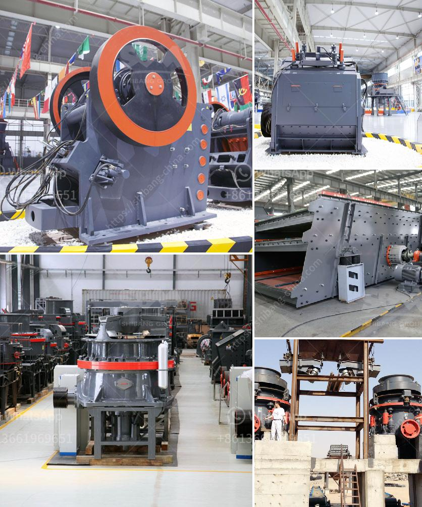

<h3>quartz processing machine</h3>
Quartz is one of the most abundant minerals found on Earth. It is a hard, crystalline mineral composed of silicon and oxygen atoms. Due to its unique properties, such as high hardness, transparency, and chemical resistance, quartz is widely used in various industries, including electronics, ceramics, optics, and construction.

To meet the growing demand for quartz products, efficient and reliable processing machines are required. These machines are designed to extract, separate, and refine quartz into different forms, such as quartz powder, quartz sand, and quartz glass. They play a crucial role in the manufacturing process and ensure the production of high-quality quartz products.

One of the most commonly used machines in quartz processing is the quartz crushing machine. It is used to crush the raw quartz material into smaller pieces for further processing. The crushing process typically involves two stages. In the first stage, the quartz is crushed to a specific size using a jaw crusher or a cone crusher. In the second stage, the crushed quartz is further ground down using a ball mill or a rod mill to achieve the desired fineness.

After crushing, the quartz is then processed through various machines for separation and purification. One of the key machines used in this stage is the magnetic separator. It utilizes the magnetic properties of quartz to separate it from other impurities, such as magnetic minerals or heavy metals. This ensures that the quartz obtained is of high purity, which is essential for its use in the electronics and optics industry.

Another important machine in quartz processing is the flotation machine. It is used to separate quartz from other minerals by utilizing the differences in their surface properties. The quartz particles are mixed with a flotation reagent and then subjected to a flotation process, where air bubbles are introduced. The quartz particles attach themselves to the air bubbles and float to the surface, while the other minerals sink. This process helps in obtaining a concentrated quartz product with high purity.

Once the quartz is separated and purified, it can be further processed into different forms based on its intended use. For instance, quartz powder is used in the production of ceramics, paints, and coatings, and as a filling material in various products. Quartz sand, on the other hand, is widely used in the construction industry as a raw material for concrete and asphalt.

In conclusion, quartz processing machines are essential in the production of high-quality quartz products. These machines, such as quartz crushing machines, magnetic separators, and flotation machines, help extract, separate, and refine quartz into different forms. They ensure the purity and quality of the quartz, making it suitable for various industries. With the increasing demand for quartz products, the development of efficient and reliable processing machines is crucial for the growth of the quartz industry.
<h3>Contact us</h3><ul><li><strong>Whatsapp:&nbsp;<a href="https://wa.me/8613661969651">+8613661969651</a></strong></li><li><a href="https://swt.shibang-china.com/?git&amp;zhl&amp;quartz processing machine"><strong>Online Service(chat now)</strong></a></li></ul><h3>Related</h3><ul><li><a href='different types of coal pulverizing ball mills.md'>different types of coal pulverizing ball mills</a></li><li><a href='nigeria minerals crusher processing company.md'>nigeria minerals crusher processing company</a></li><li><a href='dedusting systems for crushers.md'>dedusting systems for crushers</a></li><li><a href='gold hammer mill suppliers in dubai.md'>gold hammer mill suppliers in dubai</a></li><li><a href='vertical roll mill.md'>vertical roll mill</a></li></ul>