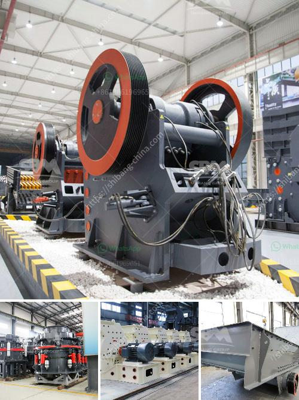

<h3>quartz stone powder machinery manufacturing companies</h3>
Quartz stone powder machinery manufacturing companies are thriving in the industry nowadays. Quartz stone powder is a key raw material for producing quartz countertops, quartz tiles, quartz slabs, quartz pipes, and other quartz products. The growing demand for these products has led to the increased production of quartz stone powder machinery manufacturing companies all over the world.

Quartz stone powder machinery manufacturing companies utilize advanced technology and modern tools to produce high-quality machinery. These machinery manufacturing companies are known for their expertise in manufacturing innovative and reliable machines. They have a team of skilled professionals who are well-versed in the latest trends and requirements of the industry.

One of the main advantages of using quartz stone powder machinery is its cost-effectiveness. These machines are designed to produce quartz stone powder with minimal waste and maximum efficiency. This ensures that the manufacturing process is efficient and cost-effective, resulting in high-quality products at competitive prices.

Another advantage of quartz stone powder machinery manufacturing companies is their commitment to sustainability. These companies adhere to strict environmental standards and ensure that their machines are energy-efficient and produce minimal waste. They also use eco-friendly materials in the production process, minimizing their carbon footprint and contributing to a greener environment.

Quartz stone powder machinery manufacturing companies are known for their excellent customer service. They provide after-sales support and maintenance services to ensure that their machines operate optimally. They also offer customization options to meet the specific needs and requirements of their customers.

In conclusion, quartz stone powder machinery manufacturing companies play a vital role in the production of high-quality quartz products. With their advanced technology, cost-effective production process, commitment to sustainability, and excellent customer service, these companies continue to thrive in the industry. The demand for quartz products is expected to increase in the coming years, and these manufacturing companies are well-equipped to meet the growing needs of the market.
<h3>Contact us</h3><ul><li><strong>Whatsapp:&nbsp;<a href="https://wa.me/8613661969651">+8613661969651</a></strong></li><li><a href="https://swt.shibang-china.com/?git&amp;zhl&amp;quartz stone powder machinery manufacturing companies"><strong>Online Service(chat now)</strong></a></li></ul><h3>Related</h3><ul><li><a href='donesia lowongan kerja kuwait cement plant.md'>donesia lowongan kerja kuwait cement plant</a></li><li><a href='vertical roller mill in taiwan.md'>vertical roller mill in taiwan</a></li><li><a href='quarry making machine from south africa.md'>quarry making machine from south africa</a></li><li><a href='calcite mining plant.md'>calcite mining plant</a></li><li><a href='technical specs 400mm x 600mm jaw crusher.md'>technical specs 400mm x 600mm jaw crusher</a></li></ul>