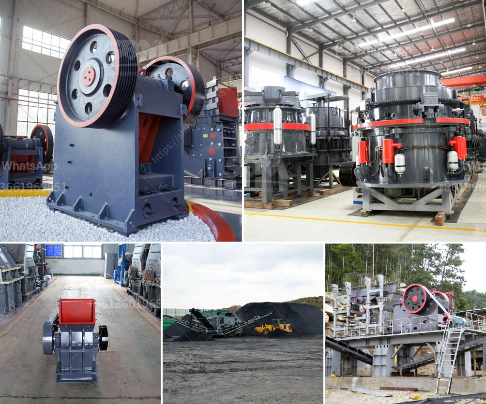

<h3>quicklime production process</h3>
Quicklime, also known as calcium oxide (CaO), is a key chemical compound used in various industrial applications. It is made through a highly controlled and precise production process that involves extracting limestone and heating it to high temperatures. In this article, we will explore the quicklime production process in detail and understand its significance in different sectors.

The first step in the production process of quicklime begins with the extraction of limestone. Limestone is a sedimentary rock composed primarily of calcium carbonate (CaCO3). It is typically sourced from open-pit quarries or underground mines. The quality and composition of limestone are essential factors as they directly impact the quality of the final product.

Once the limestone is extracted, it goes through various crushing and grinding stages to reduce its size and increase the surface area. This preparation enhances the efficiency of subsequent processes. The limestone is crushed into smaller particles and then ground into a fine powder, commonly known as limestone powder.

The next step in the quicklime production process involves the calcination of limestone powder. Calcination is a high-temperature process that removes carbon dioxide (CO2) from limestone, resulting in the formation of quicklime. The limestone powder is fed into a vertical kiln, known as a calcining kiln. Inside the kiln, the limestone is exposed to high temperatures ranging from 900°C to 1200°C.

During the calcination process, the limestone decomposes, and carbon dioxide is released. This reaction can be represented by the following chemical equation: CaCO3 (limestone) → CaO (quicklime) + CO2. The heat required for the calcination process is usually provided by burning fossil fuels, such as oil, natural gas, or coal. The choice of fuel depends on factors like cost, availability, and environmental considerations.

After the calcination process, the quicklime is discharged from the kiln and transferred to cooling and storage facilities. It is important to cool the quicklime slowly to avoid any thermal shock, which can lead to the formation of undesirable compounds. Once cooled, the quicklime is stored in silos or stockpiles for future use.

Quicklime has numerous applications across various industries. In the construction industry, it is widely used for mortar and plastering, as it reacts with water to form calcium hydroxide (Ca(OH)2). This process, known as slaking, generates large amounts of heat, which is beneficial in cold weather conditions.

Quicklime is also essential in the steelmaking industry. It is used as a flux to remove impurities and improve the quality of steel. Additionally, quicklime is utilized in environmental applications, such as municipal waste water treatment, soil stabilization, and the neutralization of acidic soil.

In conclusion, the production of quicklime is a rigorous and controlled process that involves the extraction, crushing, grinding, and calcination of limestone. This process results in the generation of quicklime, a versatile compound with various industrial applications. The quality and composition of limestone play a crucial role in determining the quality of quicklime. With its extensive uses across industries, quicklime remains a vital chemical compound contributing to numerous industrial processes and advancements.
<h3>Contact us</h3><ul><li><strong>Whatsapp:&nbsp;<a href="https://wa.me/8613661969651">+8613661969651</a></strong></li><li><a href="https://swt.shibang-china.com/?git&amp;zhl&amp;quicklime production process"><strong>Online Service(chat now)</strong></a></li></ul><h3>Related</h3><ul><li><a href='harga mesin molen di medan.md'>harga mesin molen di medan</a></li><li><a href='conveyor belts in east africa.md'>conveyor belts in east africa</a></li><li><a href='mobile jaw crusher equipment.md'>mobile jaw crusher equipment</a></li><li><a href='mobile fine jaw crusher at saudi arabia.md'>mobile fine jaw crusher at saudi arabia</a></li><li><a href='dry processing of coal in south africa.md'>dry processing of coal in south africa</a></li></ul>