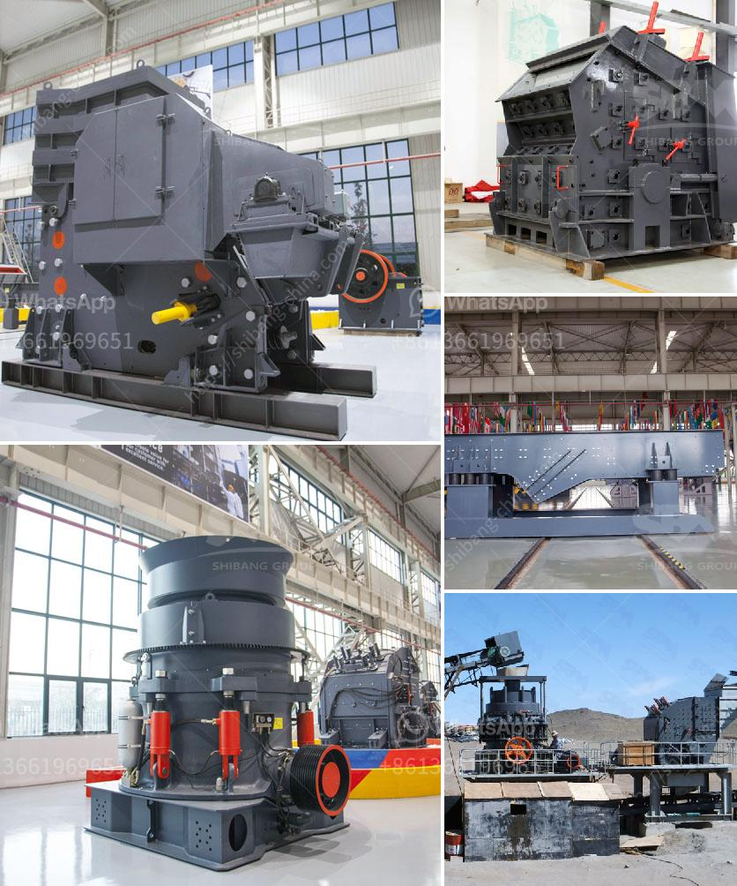

<h3>quotation for iron ore processing</h3>
Iron ore is a crucial raw material for any manufacturing industry and it plays an essential role in infrastructure development and economic growth. With the increasing demand for iron ore, the processing technologies have also rapidly advanced. In today's competitive market, it is essential for companies to have access to efficient and cost-effective iron ore processing solutions.

When companies consider iron ore processing, one of the first things they need to consider is the quotation for the services. A quotation is essentially an estimate of the cost and duration of the project. It includes details of the scope of work, the resources required, and the timeline for completion. Obtaining a detailed and accurate quotation is crucial for companies to make informed decisions and effectively manage their resources.

There are several factors that are considered while preparing a quotation for iron ore processing. These factors include the quality and quantity of the ore, the desired final product specifications, and the specific processing technologies and equipment required. The quotation should also take into account any additional services that might be needed, such as transportation, environmental regulations compliance, and waste disposal.

To obtain a quotation, companies can approach various iron ore processing service providers. These service providers specialize in different aspects of iron ore processing, such as beneficiation, pelletizing, or smelting. It is important to choose a service provider with a good reputation, extensive experience, and advanced technologies. This ensures that the company receives high-quality services that meet their specific requirements.

One of the key considerations while obtaining a quotation is the cost. The cost of iron ore processing can vary significantly depending on various factors, such as the complexity of the project, the size of the processing plant, and the quality and quantity of the ore. Companies should carefully review the quotation in terms of the cost breakdown and ensure that all the necessary services are included without any hidden charges.

Another important factor to consider is the timeline for completing the project. Time is of the essence in the iron ore processing industry as delays can lead to financial losses. The quotation should provide a clear timeline and specify the milestones to be achieved during the project. It is important to choose a service provider who can commit to realistic and achievable timelines to ensure smooth project execution.

In conclusion, obtaining a detailed quotation for iron ore processing is crucial for companies to effectively plan and manage their resources. The quotation should consider factors such as cost, timeline, and required services. Companies should choose reputable service providers with advanced technologies and extensive experience to ensure high-quality and efficient iron ore processing services. By obtaining accurate and detailed quotations, companies can make informed decisions and achieve successful iron ore processing projects.
<h3>Contact us</h3><ul><li><strong>Whatsapp:&nbsp;<a href="https://wa.me/8613661969651">+8613661969651</a></strong></li><li><a href="https://swt.shibang-china.com/?git&amp;zhl&amp;quotation for iron ore processing"><strong>Online Service(chat now)</strong></a></li></ul><h3>Related</h3><ul><li><a href='vertical cement mill grinding plant.md'>vertical cement mill grinding plant</a></li><li><a href='gypsum mines in orissa india.md'>gypsum mines in orissa india</a></li><li><a href='calculation of owning and operating costs of crushers.md'>calculation of owning and operating costs of crushers</a></li><li><a href='used basalt stone jaw crusher for sale.md'>used basalt stone jaw crusher for sale</a></li><li><a href='enquiry stone crusher.md'>enquiry stone crusher</a></li></ul>