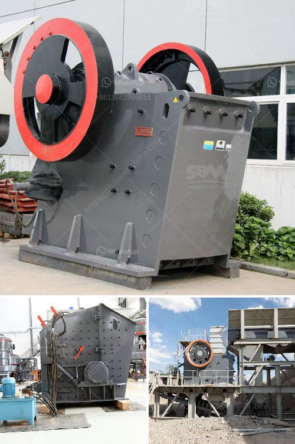

<h3>quote for china crusher</h3>
China, being a global manufacturing hub, has always been at the forefront of technological advancements. Crushers, a fundamental equipment for the mining and construction industry, have also seen remarkable innovations in the Chinese market. These advancements have empowered China-based manufacturers to produce high-quality, efficient, and reliable crushers at competitive prices.

The Chinese crusher industry has witnessed a significant transformation over the past decade. Chinese manufacturers are leveraging advanced technologies to design crushers that deliver exceptional performance, ensuring maximum productivity for various applications.

One of the primary reasons for China's dominance in the crusher market is its robust domestic supply chain. From sourcing raw materials to final assembly, Chinese manufacturers possess an intricate network of suppliers and production facilities, allowing them to streamline the entire manufacturing process. This efficiency not only reduces costs but also enhances the overall quality of the crusher.

Moreover, China's crusher manufacturers have invested heavily in research and development (R&D) to enhance product capabilities. The continuous innovation in crusher design has led to the development of crushers that have higher crushing ratios, improved operational reliability, and increased energy efficiency.

Chinese crushers are increasingly being regarded as a cost-effective alternative to international brands. The availability of affordable spare parts and efficient after-sales services further adds value to the Chinese crushers. Additionally, Chinese manufacturers actively collaborate with local customers to customize the crusher solution according to specific requirements, ensuring customer satisfaction and loyalty.

Furthermore, the growing focus on environmental sustainability has prompted Chinese crusher manufacturers to develop eco-friendly solutions. These crushers incorporate advanced dust suppression and noise reduction systems while maintaining optimal efficiency, meeting both environmental regulations and customer demands.

The Chinese crusher industry has rapidly evolved, offering technologically advanced crushers that are highly efficient, reliable, and cost-effective. With a robust domestic supply chain and significant investments in R&D, Chinese manufacturers have successfully achieved competitiveness on a global scale. As the industry continues to innovate, the future of Chinese crushers appears promising, revolutionizing the global market.
<h3>Contact us</h3><ul><li><strong>Whatsapp:&nbsp;<a href="https://wa.me/8613661969651">+8613661969651</a></strong></li><li><a href="https://swt.shibang-china.com/?git&amp;zhl&amp;quote for china crusher"><strong>Online Service(chat now)</strong></a></li></ul><h3>Related</h3><ul><li><a href='jaw crushers prices in zimbabwe.md'>jaw crushers prices in zimbabwe</a></li><li><a href='conveyor belt equipment for mining south africa.md'>conveyor belt equipment for mining south africa</a></li><li><a href='ball mill supplier in malaysia pakistan.md'>ball mill supplier in malaysia pakistan</a></li><li><a href='jaw crusher calculating.md'>jaw crusher calculating</a></li><li><a href='crusher sand machine south africa.md'>crusher sand machine south africa</a></li></ul>