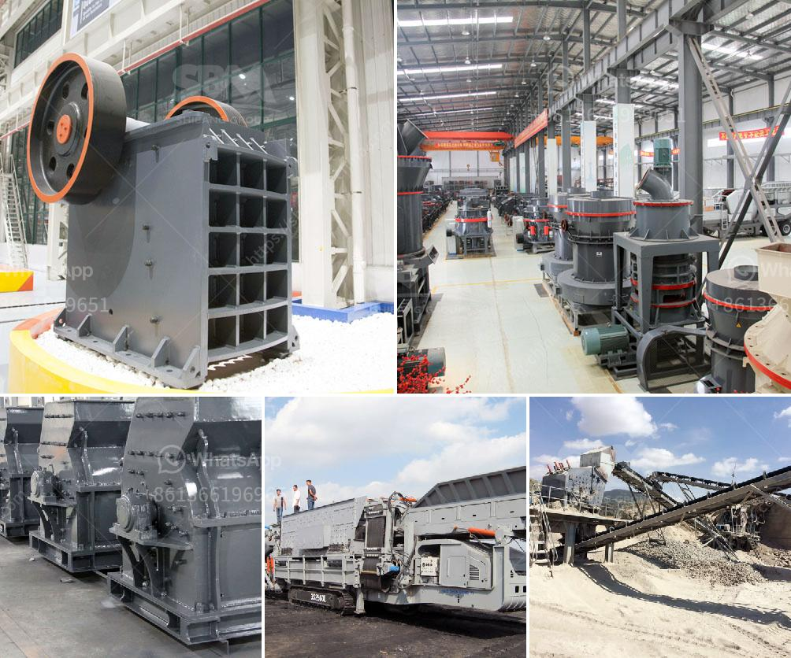

<h3>quote for stone crusher</h3>
Stone crushing industry is an important industrial sector in the country, engaged in producing crushed stone of various sizes depending upon the requirement which acts as raw material for various construction activities such as construction of roads, highways, bridges, buildings, canals etc. It is estimated that there are over 12,000 stone crusher units in India. The number is expected to grow further keeping in view the future plans for development of infrastructure of roads, canals and buildings that are required for overall development of the country.

In India, the Stone Crushing Industry sector is estimated to have an annual turnover of Rs. 5000 crore (equivalent to over US$ 1 billion) and is therefore an economically important sector. The sector is estimated to be providing direct employment to over 500,000 people engaged in various activities such as mining, crushing plant, transportation of mined stones and crushed products etc. Most of these personnel are from rural and economically backward areas where employment opportunities are limited. In view of this, the government encourages local manufacturers to participate in the stone crushing industry.

To meet the increasing demand for stone crushing plants, the machinery manufacturers are also increasing their production capacity. This has led to increased attention to the artificial stone and sand manufacturing industry, which has further promoted the development of the stone crusher industry. Speaking of the development prospects of the industry, we can start with the analysis of the crusher industry:

First of all, the industry overview is essential to analyze the future development trend. The current situation of the stone crusher industry is very good. The crushing equipment manufacturers have roared, and the long-term manufacturers must look away. From a functional point of view, the stone crusher industry has been characterized by a sufficient level of development. At present, there are no large projects that require large-scale crushing equipment to start operations.

Secondly, the investment prospects of the stone crusher industry are good. With the decrease in natural sand and gravel reserves, there is an increasing demand for crushed stone and manufactured sand as construction materials. This requires high-quality stone crushing equipment, which can be achieved by investing in the right kind of machinery. For a business like this, the return on investment is typically high.

Lastly, the competitiveness of the stone crusher industry is high. To stay competitive, companies need to invest in areas where they can obtain new technology, reduce costs and improve quality. The stone crusher industry is a highly competitive market, so companies need to be innovative and develop new ideas to stay ahead of the competition. In addition to the expansion of capacity, companies also need to focus on increasing efficiency and reducing environmental impact.

To summarize, the stone crusher industry has a promising future due to its potential for growth, rising demand, and high competitiveness. With proper planning and execution, investing in this industry can be a profitable venture. However, it is important for companies to carefully analyze their investment options and consider factors such as market trends, competitive landscape, and technological advancements. With the right strategy, the stone crusher industry can thrive and contribute to the development of the country's infrastructure.
<h3>Contact us</h3><ul><li><strong>Whatsapp:&nbsp;<a href="https://wa.me/8613661969651">+8613661969651</a></strong></li><li><a href="https://swt.shibang-china.com/?git&amp;zhl&amp;quote for stone crusher"><strong>Online Service(chat now)</strong></a></li></ul><h3>Related</h3><ul><li><a href='used coal wash plant canada for sale.md'>used coal wash plant canada for sale</a></li><li><a href='rock crusher companies.md'>rock crusher companies</a></li><li><a href='price list of used stone crushers in kenya.md'>price list of used stone crushers in kenya</a></li><li><a href='vibration screen machine in pakistan.md'>vibration screen machine in pakistan</a></li><li><a href='250tph comprehensive portable crushing plant.md'>250tph comprehensive portable crushing plant</a></li></ul>