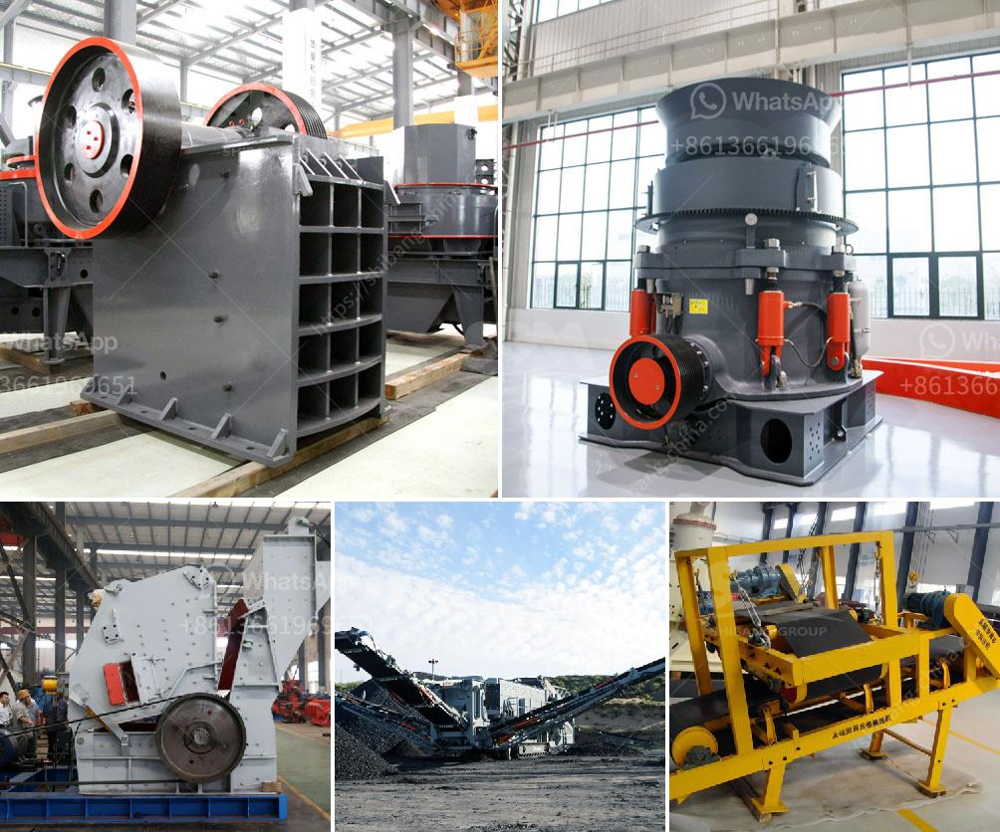

<h3>raymond grinding machine</h3>
The Raymond grinding machine is a highly versatile tool that is used to grind various materials such as minerals, chemicals, ores, and many others. This machine is suitable for grinding materials with Mohs hardness below 9.3 and humidity below 6%. It is widely used in mining, construction, chemical industry, metallurgy, and other industries. With its excellent performance and reliability, it has become an indispensable tool in these sectors.

The Raymond grinding machine consists of a main unit, a classifier, a piping device, a blower, a dust collector, and other components. Its working principle involves the suspension of the material on the main unit, where the grinding roller rotates around the vertical axis while the grinding ring is stationary. The material is repeatedly ground by the rollers until it reaches the desired fineness. The classifier controls the size of the final product, while the blower and dust collector ensure a safe and clean working environment.

One of the key advantages of the Raymond grinding machine is its high efficiency. The machine is designed to achieve high production rates while consuming less energy. Its unique design and optimized airflow ensure that the material is ground efficiently with minimal energy losses. This not only reduces operational costs but also helps to protect the environment by reducing energy consumption.

Another advantage of the Raymond grinding machine is its versatility. It can grind a wide range of materials, including limestone, dolomite, marble, barite, kaolin, gypsum, talc, and many others. This versatility allows it to be used in various industries, such as mining, construction, chemical industry, and metallurgy. Whether it is used to grind raw materials for cement production or to produce fine powders for pharmaceutical applications, the Raymond grinding machine can handle it all.

Moreover, the Raymond grinding machine is known for its high reliability and low maintenance requirements. The machine is built to withstand heavy-duty operation and has a long service life. Its components are made of high-quality materials, and its design is optimized for durability. This ensures that the machine can operate smoothly and efficiently for an extended period, with minimal downtime and maintenance.

In conclusion, the Raymond grinding machine is a highly versatile tool that is suitable for various industries. Its high efficiency, versatility, and reliability make it an indispensable tool in mining, construction, chemical industry, metallurgy, and other sectors. Whether it is used for grinding minerals, chemicals, or ores, this machine delivers excellent performance consistently. Additionally, its energy-saving design and low maintenance requirements contribute to its appeal among industry professionals. With all these features combined, the Raymond grinding machine is undoubtedly a valuable asset for any industry that requires materials to be ground to the desired fineness.
<h3>Contact us</h3><ul><li><strong>Whatsapp:&nbsp;<a href="https://wa.me/8613661969651">+8613661969651</a></strong></li><li><a href="https://swt.shibang-china.com/?git&amp;zhl&amp;raymond grinding machine"><strong>Online Service(chat now)</strong></a></li></ul><h3>Related</h3><ul><li><a href='sand washer machine manual.md'>sand washer machine manual</a></li><li><a href='gold processing mecury sales gauteng.md'>gold processing mecury sales gauteng</a></li><li><a href='design drawings of a hammer mill.md'>design drawings of a hammer mill</a></li><li><a href='gold sand separation equipment philippines.md'>gold sand separation equipment philippines</a></li><li><a href='biggest rock crusher.md'>biggest rock crusher</a></li></ul>