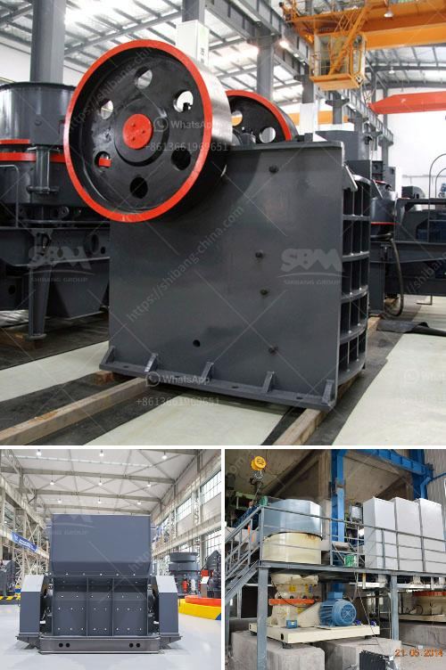

<h3>raymond grinding mill germany</h3>
Raymond grinding mill, also known as Raymond mill, is a widely used grinding equipment for processing various non-flammable and explosive minerals. It has a broad market prospect due to its high cost performance, deep processing capacity, energy saving and environmental protection. Raymond mill is widely used in the grinding and processing of materials in the fields of metallurgy, building materials, chemical industry, mining, etc., suitable for processing various non-flammable and explosive ores with Mohs hardness below 7 and humidity below 6%.

Raymond grinding mill Germany is an industrial mill imported from abroad. It is currently one of the most advanced production lines on the market. The system includes jaw crusher, impact crusher, cone crusher, vibrating feeder, vibrating screen, belt conveyor, etc., which can effectively process various materials with high performance and high production capacity.

The Raymond grinding mill Germany consists of a main machine, an analysis machine, a blower, a finished cyclone separator, a pipeline device, a motor and the like. The main machine consists of a frame, an air inlet volute, a shovel grinding roller, a grinding ring, a cover and a motor. Raymond mill relies on the rotation of the grinding roller and the grinding ring to crush the materials and grind them.

Germany's Raymond grinding mill is mainly used for processing natural ores, but also for processing artificial raw materials and chemical raw materials. It can be seen that the production capacity of Raymond mill in Germany is relatively large, and it is suitable for large-scale processing plants.

The main materials processed by Raymond mill Germany include limestone, calcite, barite, dolomite, potassium feldspar, marble, talc, gypsum, kaolin, bentonite, medical stone, phosphate rock, manganese ore, iron ore, quartz, active carbon, carbon black, ceramic, coal, etc. It can be said that Raymond grinding mill Germany covers all kinds of materials for grinding, and the effect is remarkable.

The Raymond grinding mill Germany has many advantages. First, the fineness of the finished product can be adjusted freely. The Raymond mill can process materials with a particle size of 20-325 mesh, which can be adjusted flexibly according to the needs of different users. Second, the equipment has a small footprint and low noise. The whole system is tightly sealed, and the dust will not overflow during operation, which creates a good working environment. Third, the equipment has high efficiency and low energy consumption. The grinding roller and the grinding ring adopt the advanced wear-resistant structure design, which can greatly improve the service life of the equipment and reduce the maintenance cost. Fourth, the equipment has a wide range of applications. It can be used for grinding various non-flammable and explosive materials with hardness below 7, humidity below 6%, and the final fineness can be adjusted at will.

In conclusion, the Raymond grinding mill Germany has won the favor of the majority of users with its outstanding performance and high cost performance. In the future development, it will continue to innovate and improve, and constantly meet the needs of users with higher quality products and services.
<h3>Contact us</h3><ul><li><strong>Whatsapp:&nbsp;<a href="https://wa.me/8613661969651">+8613661969651</a></strong></li><li><a href="https://swt.shibang-china.com/?git&amp;zhl&amp;raymond grinding mill germany"><strong>Online Service(chat now)</strong></a></li></ul><h3>Related</h3><ul><li><a href='iron ore beneficiation process in mexico.md'>iron ore beneficiation process in mexico</a></li><li><a href='ball mills for rent.md'>ball mills for rent</a></li><li><a href='diagram of hammer mill machine.md'>diagram of hammer mill machine</a></li><li><a href='india herzog pulverizer hp m 100 p venta.md'>india herzog pulverizer hp m 100 p venta</a></li><li><a href='mining of copper crusher in sudan.md'>mining of copper crusher in sudan</a></li></ul>