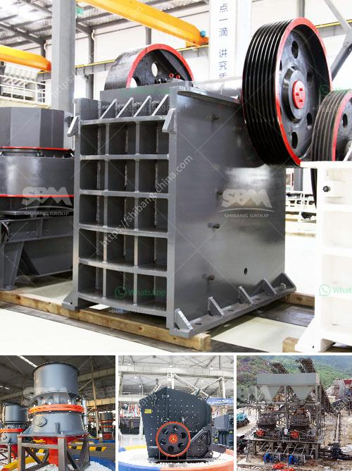

<h3>raymond mill supplier</h3>
In the field of industrial milling, one name has become synonymous with efficiency, reliability, and high-quality performance - Raymond Mill. And behind every successful Raymond Mill is a trusted and leading supplier that ensures the machinery's durability and optimal functioning. Today, we will delve into the intricacies of Raymond Mill suppliers and shed light on the qualities that make them a desirable partner in the journey towards achieving manufacturing excellence.

A Raymond Mill supplier plays a crucial role in the success of any industrial operation as they are responsible for providing high-quality equipment, timely maintenance, and excellent customer service. With a vast market for Raymond Mills, it is crucial to identify a supplier that not only delivers superior machinery but also understands the unique requirements and challenges of specific industries.

The first characteristic of a successful Raymond Mill supplier is their expertise and experience in the field. A supplier that has been working in the industry for several years is more likely to have honed their skills and gained valuable knowledge about the nuances of Raymond Mills. They should be able to adapt their solutions to cater to the needs of diverse industries, such as mining, construction, or chemical manufacturing.

Moreover, a reliable supplier should possess a wide range of Raymond Mills, catering to various production capacities and product specifications. This ensures that businesses of all sizes, from small-scale operations to large industrial plants, can find the right equipment that meets their needs. The supplier should also offer customized solutions and the flexibility to modify Raymond Mills to suit unique process requirements.

Alongside the quality of equipment, the supplier's ability to provide timely maintenance and repair services is a crucial factor to consider. Raymond Mills, like any machinery, require regular upkeep to ensure optimal performance and prolonged lifespan. A reputable supplier understands the importance of proactive maintenance and should offer expert technicians who can promptly address any issues or breakdowns. They should also provide spare parts readily, minimizing downtime and maximizing productivity.

Customer service is another vital aspect that sets reputable Raymond Mill suppliers apart from their competitors. A reliable supplier should value their customers and prioritize building long-term relationships. Their customer service team should be readily available to address any queries or concerns and provide timely assistance. Being responsive, attentive, and transparent in their communication solidifies the trust and confidence placed in the supplier.

Lastly, a leading supplier should stay updated with the latest advancements in Raymond Mill technology and continuously strive for innovation. By investing in research and development, they can offer advanced machinery that enhances productivity, energy efficiency, and environmental sustainability. Keeping pace with evolving industry trends and regulations ensures that their customers remain competitive and future-ready.

In conclusion, the success of any Raymond Mill operation greatly depends on the quality and support provided by the supplier. By considering factors such as expertise, equipment options, maintenance services, customer support, and innovation, businesses can make an informed decision when choosing a Raymond Mill supplier. Partnering with a reliable supplier ensures a seamless and productive manufacturing journey that maximizes efficiency and profitability.
<h3>Contact us</h3><ul><li><strong>Whatsapp:&nbsp;<a href="https://wa.me/8613661969651">+8613661969651</a></strong></li><li><a href="https://swt.shibang-china.com/?git&amp;zhl&amp;raymond mill supplier"><strong>Online Service(chat now)</strong></a></li></ul><h3>Related</h3><ul><li><a href='used raymond mill for sale in taiwan crusher.md'>used raymond mill for sale in taiwan crusher</a></li><li><a href='how much does it cost to build a slag processing plant.md'>how much does it cost to build a slag processing plant</a></li><li><a href='china coal mill grinder manufacturers china.md'>china coal mill grinder manufacturers china</a></li><li><a href='how to build a small rock crusher.md'>how to build a small rock crusher</a></li><li><a href='small stone brick crusher.md'>small stone brick crusher</a></li></ul>