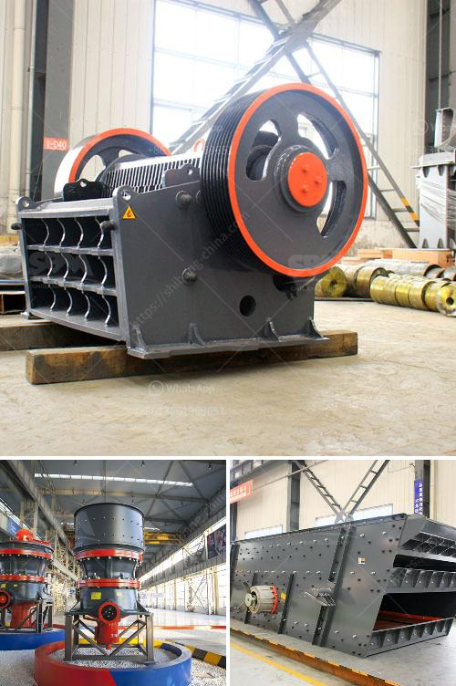

<h3>raymond mill to crusher quartz to 1500 mesh</h3>
Quartz is a common mineral found in various parts of the world. It is used in numerous industries due to its durability and versatility. To fully utilize its potential, quartz needs to be crushed and processed into fine particles. One effective way to achieve this is through the use of Raymond mills.

Raymond Mill, also known as Raymond Grinding Mill, is a versatile machine that is extensively used for grinding various materials, including quartz. A Raymond mill to crush quartz to 1500 mesh can produce particles of different sizes ranging from 0-425 microns, or 0.613mm to 0.044mm.

The finer the particles, the higher the quality of quartz, which is why it is essential to choose a machine that ensures efficient grinding. Raymond Mill has proven to be an excellent choice. Its advanced grinding technology and high-quality components guarantee the production of finer particles, making it a preferred option for crushing quartz.

With its adjustable speed, Raymond Mill allows operators to control the grinding process, ensuring consistent particle size distribution. The machine's reliable performance guarantees long-term operation, minimizing maintenance requirements and production downtime.

The 1500 mesh size obtained by Raymond Mill can be used in various industries. In the construction sector, finely crushed quartz can be incorporated into concrete mixes, enhancing its strength and durability. In the electronics industry, 1500 mesh quartz particles are used as a key component in the manufacturing of semiconductors and other electronic devices.

Moreover, the versatility of Raymond Mill extends beyond quartz grinding, as it can also be used for grinding other non-flammable and non-explosive minerals with hardness levels below 7 and moisture content below 6%.

In conclusion, Raymond Mill is a powerful grinding machine that can crush quartz into fine particles with great efficiency and quality. Its wide range of applications and adjustable grinding speed make it an ideal choice for industries that rely on the production of finely ground quartz. By harnessing the potential of Raymond Mill, companies can unlock the full capabilities of quartz and boost their productivity and product quality.
<h3>Contact us</h3><ul><li><strong>Whatsapp:&nbsp;<a href="https://wa.me/8613661969651">+8613661969651</a></strong></li><li><a href="https://swt.shibang-china.com/?git&amp;zhl&amp;raymond mill to crusher quartz to 1500 mesh"><strong>Online Service(chat now)</strong></a></li></ul><h3>Related</h3><ul><li><a href='georgia cement mini plant.md'>georgia cement mini plant</a></li><li><a href='how to crusher granite.md'>how to crusher granite</a></li><li><a href='prices for cement processing machines.md'>prices for cement processing machines</a></li><li><a href='harga pe jc jaw crusher dan harga.md'>harga pe jc jaw crusher dan harga</a></li><li><a href='marble jaw crusher.md'>marble jaw crusher</a></li></ul>