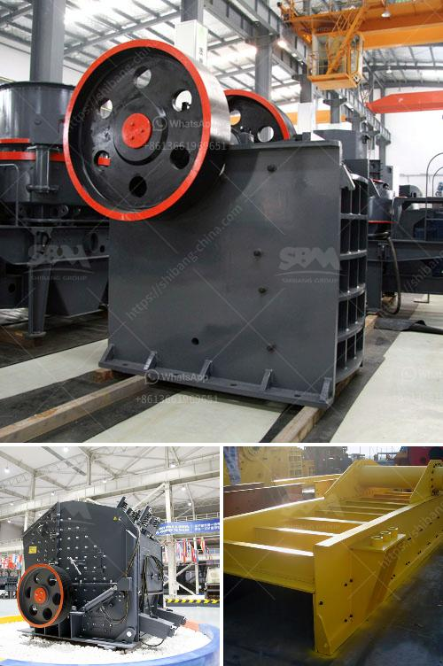

<h3>removing iron from silica sand</h3>
Silica is a key raw material for many industries, including glass, ceramics, and foundry. To maintain the desired quality of these products, it is crucial to remove impurities such as iron from silica sand. Iron can present in silica in various forms, including as an impurity mineral or as staining on the surface of the sand grains. The presence of iron can affect the properties of the final product, leading to unwanted discoloration, reduced strength, or decreased transparency. Hence, the removal of iron is a critical step in silica sand processing.

Various techniques exist for removing iron from silica sand, and the choice of method depends on the desired level of iron and the specific application requirements. One common technique is physical beneficiation, which involves scrubbing the sand to break up any attached iron-containing minerals and then removing them through processes like screening, flotation, or magnetic separation. This method effectively removes iron while preserving the intrinsic properties of the silica sand.

Chemical methods can also be employed to remove iron from silica sand. Acid leaching is commonly used, where the sand is treated with an acid solution to dissolve the iron and then further rinsed to remove the dissolved impurities. This method is particularly effective for high levels of iron removal but requires careful control of the acid concentration and temperature to avoid damaging the silica grains.

Another technique for iron removal is thermal processing. The sand can be heated to high temperatures, causing the iron impurities to oxidize and form compounds that are more easily separated from the silica. This method is energy-intensive but can be useful for large-scale industrial operations.

The successful removal of iron from silica sand not only ensures product quality but also improves the overall efficiency of downstream processes. Reduced iron content can lead to lower energy consumption in glass melting or improved mold quality in foundry applications. Moreover, removing iron early in the processing chain minimizes the risk of contamination in subsequent steps, saving time and resources.

In conclusion, the removal of iron from silica sand is a vital step to ensure high-quality silica production. Various physical, chemical, and thermal methods can be employed for this purpose, depending on the desired level of iron removal and the specific application requirements. By effectively eliminating iron impurities, industries can enhance the quality and efficiency of their products, thereby promoting sustainable growth and economic development.
<h3>Contact us</h3><ul><li><strong>Whatsapp:&nbsp;<a href="https://wa.me/8613661969651">+8613661969651</a></strong></li><li><a href="https://swt.shibang-china.com/?git&amp;zhl&amp;removing iron from silica sand"><strong>Online Service(chat now)</strong></a></li></ul><h3>Related</h3><ul><li><a href='portable stone crusher for sale.md'>portable stone crusher for sale</a></li><li><a href='ton crusher plant price.md'>ton crusher plant price</a></li><li><a href='small sand washing machine.md'>small sand washing machine</a></li><li><a href='granite mining in zimbabwe.md'>granite mining in zimbabwe</a></li><li><a href='gold mill equipment zimbabwe.md'>gold mill equipment zimbabwe</a></li></ul>