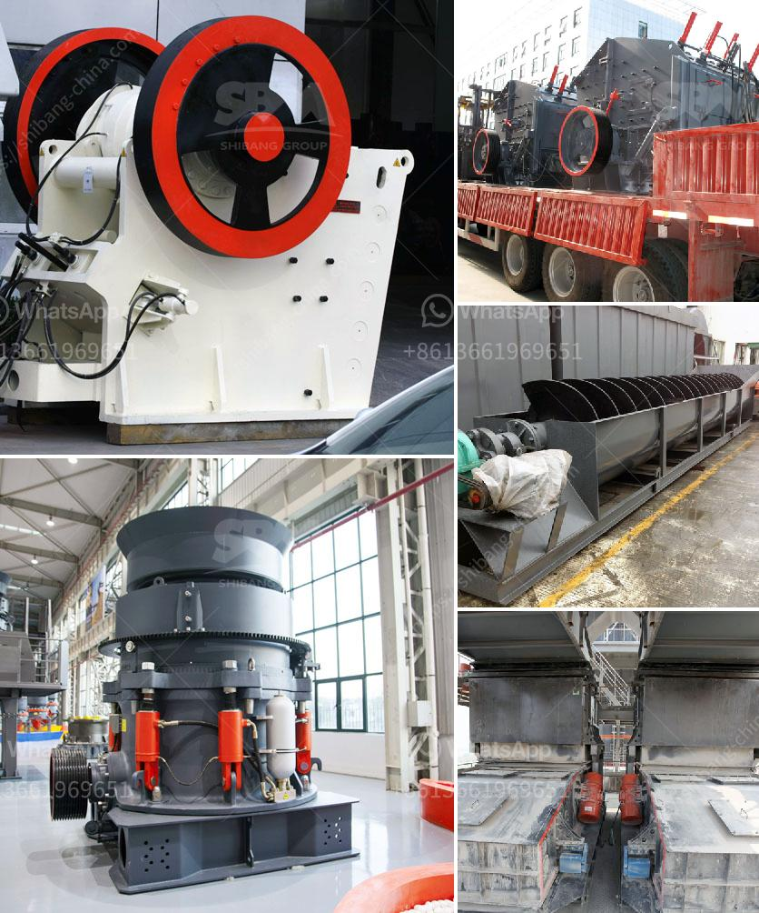

<h3>renting of screens and crushers</h3>
In the world of construction, time is money. Efficiency and cost-effectiveness are key factors in successfully completing any project. One aspect that can greatly contribute to these factors is the rental of screens and crushers.

Screens and crushers are essential equipment in construction projects involving the processing and crushing of various materials. From gravel and sand to concrete and asphalt, these machines are used to break down larger pieces into smaller, more manageable sizes. They are crucial in the production of high-quality aggregates required for construction purposes.

Renting screens and crushers is becoming increasingly popular for several reasons. For one, it significantly reduces upfront investment costs. Purchasing these machines outright can be expensive, especially for smaller construction companies or individuals working on a one-time project. Renting, on the other hand, allows for the use of state-of-the-art equipment at a fraction of the cost.

Moreover, rental services provide flexibility. With various models and sizes available, contractors can choose the most suitable machines for their specific needs. Whether it's a small-scale residential project or a large-scale commercial endeavor, screens and crushers can be rented to match the size and requirements of the job at hand.

Rentals also offer convenience and peace of mind. Equipment maintenance and repairs can be costly and time-consuming. By renting, contractors can avoid these additional responsibilities and focus on their core tasks. Rental companies typically provide well-maintained equipment that undergoes regular inspections, ensuring optimal performance on-site.

Additionally, renting screens and crushers allows for easy scalability. As projects evolve, the demand for equipment may change. Rental services enable contractors to adapt to these fluctuations promptly. They can easily upgrade or downgrade the rented equipment based on their current needs, thus avoiding unnecessary expenses.

Lastly, rentals provide an opportunity to try out different models and brands without long-term commitments. Contractors can assess the efficiency and performance of various machines before deciding on a potential investment in the future. This allows for informed decision-making based on actual experience.

In conclusion, the rental of screens and crushers has become a game-changer in the construction industry. With reduced costs, increased flexibility, convenience, and scalability, contractors can optimize their projects, saving time and money. By taking advantage of state-of-the-art equipment through rentals, construction companies can stay competitive and deliver excellent results.
<h3>Contact us</h3><ul><li><strong>Whatsapp:&nbsp;<a href="https://wa.me/8613661969651">+8613661969651</a></strong></li><li><a href="https://swt.shibang-china.com/?git&amp;zhl&amp;renting of screens and crushers"><strong>Online Service(chat now)</strong></a></li></ul><h3>Related</h3><ul><li><a href='cement machinery manufacturers in europe.md'>cement machinery manufacturers in europe</a></li><li><a href='quartz crusher plant.md'>quartz crusher plant</a></li><li><a href='stone crusher second.md'>stone crusher second</a></li><li><a href='stone crussing machines in pakistan.md'>stone crussing machines in pakistan</a></li><li><a href='calcite mining plant.md'>calcite mining plant</a></li></ul>