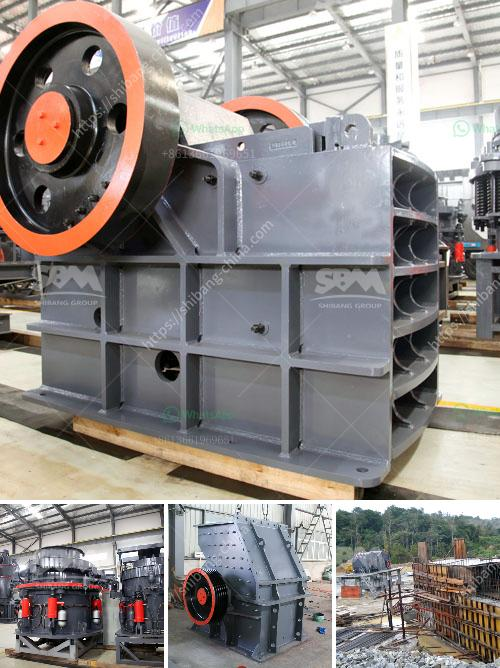

<h3>river sand garnet processing machines</h3>
River sand garnet processing machines are generally used to separate coarse sand (10-20 mesh) from fine sand (20-40 mesh), and they can be installed at the end of the sand washing line, or used alone to extract high-purity sand from river or sea sand.

About 15% of the sand processed by the river sand garnet processing machine is directly used in the construction industry, while the remaining 85% is used as a raw material for the production of quartz sand, glass sand, and other high-purity materials.

1. Feeding: The river sand garnet enters the sand-making machine through the feeding hopper. The material is divided into two parts by the feeder. A part is directly processed into sand, and the other part is to enter the sand washer for cleaning.

2. Cleaning: The cleaning process is mainly washing, classifying, and impurity removal of the sand. The washed sand is dehydrated by a dewatering screen and transported to the finished product pile by the belt conveyor.

3. Separation: The river sand garnet processing machine separates the sand particles into five different sizes of sand through a vibrating screen. After screening, the sand is stacked in different piles according to the particle size.

4. Drying: The high-purity sand obtained through the river sand garnet processing machine still contains some water, so it needs to be dried by a drying machine to meet the moisture content requirements of the high-purity sand.

5. Sorting: The sorted sand is usually transported to different warehouses or directly loaded onto trucks for transportation to different customers. The sorted high-purity sand has a wide range of applications, such as the construction industry, glass industry, foundry industry, etc.

The river sand garnet processing machine has the advantages of stable operation, high output, and good cleaning effect. It is suitable for construction sites, sand washing plants, and hydropower stations where sand and aggregates are needed.

In addition, the river sand garnet processing machine has low energy consumption, low noise, and no pollution during operation, which effectively protects the environment and ensures the safety of operators.

As a highly efficient and environmentally friendly sand processing equipment, river sand garnet processing machines play an important role in various industries. With the continuous advancement of technology, the performance of river sand garnet processing machines will continue to be optimized, making them more efficient and easier to operate.

In conclusion, river sand garnet processing machines are essential equipment in sand processing plants, providing high-quality sand and aggregate materials for various industries. Their advanced technology and reliable performance make them indispensable in the sand processing industry.
<h3>Contact us</h3><ul><li><strong>Whatsapp:&nbsp;<a href="https://wa.me/8613661969651">+8613661969651</a></strong></li><li><a href="https://swt.shibang-china.com/?git&amp;zhl&amp;river sand garnet processing machines"><strong>Online Service(chat now)</strong></a></li></ul><h3>Related</h3><ul><li><a href='belt conveyor design.md'>belt conveyor design</a></li><li><a href='crushing plants south africa.md'>crushing plants south africa</a></li><li><a href='stearic acid coating machine for calcium carbonate.md'>stearic acid coating machine for calcium carbonate</a></li><li><a href='price pe 600 and 900 stone crusher.md'>price pe 600 and 900 stone crusher</a></li><li><a href='mobile crusher in codelco.md'>mobile crusher in codelco</a></li></ul>