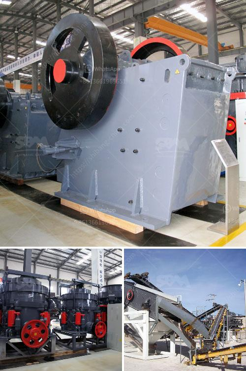

<h3>river sand processing method</h3>
River sand is a widely used construction material, with its applications ranging from the making of concrete to the production of glass. As a result, the demand for river sand is high, leading to illegal sand mining and excessive extraction of sand from riverbeds, which can cause adverse environmental impacts. To address this issue, it is essential to employ proper river sand processing methods that minimize the environmental footprint while maintaining the quality of the sand.

One of the effective methods for processing river sand is through the implementation of sedimentation tanks. Sedimentation tanks are large, shallow basins where the sand-water mixture is allowed to settle, enabling the separation of sand particles from the water. This method is effective in removing large impurities such as wood debris or large rocks since they quickly settle at the bottom of the tank. The clarified water is then discharged, leaving the settled sand for further processing.

After the sedimentation process, the sand needs to undergo a thorough cleaning to eliminate fine particles and impurities. This is typically achieved through the implementation of a sand washing plant. The sand is first transferred to a vibrating screen, which separates the coarse sand particles from the fine particles. The fine sand is then sent to a hydrocyclone, where a high-speed rotating flow is generated to remove the remaining impurities. The purified sand is finally discharged, ready for use in construction applications.

Another critical step in river sand processing is the removal of clay and silt. Fine particles of clay and silt can negatively affect the quality and workability of concrete. These particles can be removed through a process called attrition scrubbing. Attrition scrubbing involves the sand particles rubbing against each other, thereby dislodging the clay and silt. This process is typically carried out in a sand attrition scrubber, where the sand is mixed with a water-based solution and vigorously agitated. The scrubbed sand is then rinsed and dewatered to obtain clean sand with reduced clay and silt content.

In addition to the above methods, river sand can also be processed by utilizing air classifiers or density separators. Air classifiers use air as a medium to sort sand particles based on their size and shape, ensuring a consistent and high-quality product. Density separators, on the other hand, utilize hydraulic forces to separate sand particles based on their density, enabling the removal of heavy minerals and contaminants.

It is important to note that these processing methods should be conducted in compliance with local regulations and environmental standards. Proper measures should be taken to prevent the release of sediment-laden water or harmful chemicals into the environment. Additionally, sustainable practices, such as the use of recycled water or the restoration of mined areas, should be incorporated to minimize the environmental impact of river sand processing.

In conclusion, the proper processing of river sand is crucial to meet the construction industry's demand while minimizing environmental degradation. Methods such as sedimentation tanks, sand washing plants, attrition scrubbing, air classifiers, and density separators can effectively remove impurities and improve the quality of river sand. These methods should be implemented in conjunction with sustainable practices to ensure the long-term viability of river sand extraction.
<h3>Contact us</h3><ul><li><strong>Whatsapp:&nbsp;<a href="https://wa.me/8613661969651">+8613661969651</a></strong></li><li><a href="https://swt.shibang-china.com/?git&amp;zhl&amp;river sand processing method"><strong>Online Service(chat now)</strong></a></li></ul><h3>Related</h3><ul><li><a href='ball mill modual continuous ball mill.md'>ball mill modual continuous ball mill</a></li><li><a href='zinc ash crusher machine required.md'>zinc ash crusher machine required</a></li><li><a href='coal crusher equipment.md'>coal crusher equipment</a></li><li><a href='vertical raw mill industry.md'>vertical raw mill industry</a></li><li><a href='mtm trapezium grinder mill.md'>mtm trapezium grinder mill</a></li></ul>