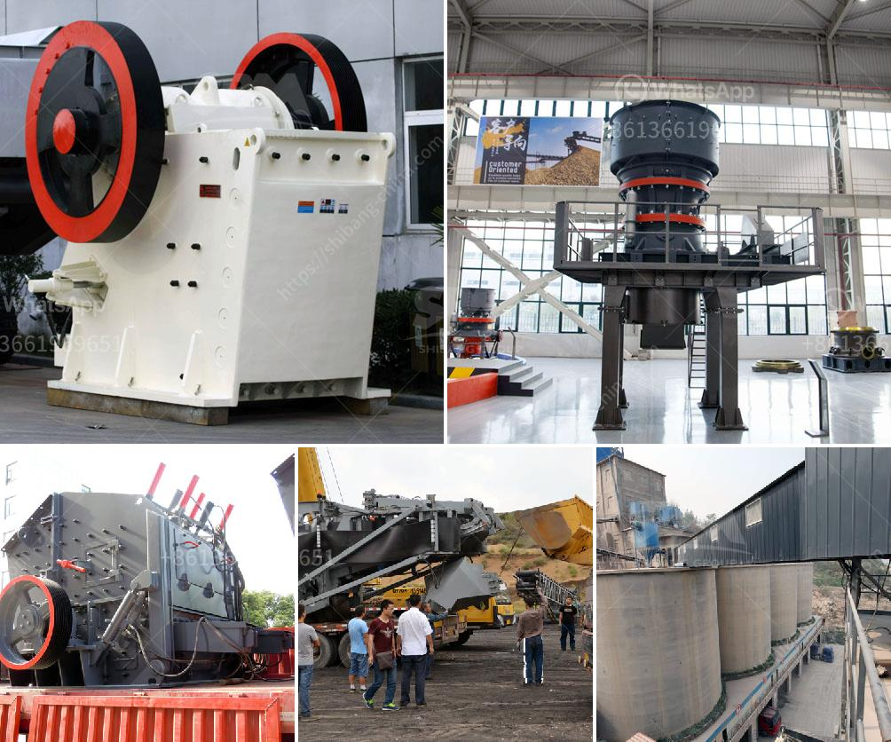

<h3>river sand suppliers in northern cape</h3>
The Northern Cape region of South Africa has a diverse landscape that is home to some of the most breathtaking rivers and natural resources. One such resource is river sand, a crucial ingredient in various construction and landscaping projects. Thankfully, the region boasts several reputable river sand suppliers who are committed to providing high-quality products.

River sand is widely used in the construction industry for its strength and durability. It is a key component in the production of concrete, which is the foundation of most buildings and infrastructure. River sand is also used for creating pathways, driveways, and landscaping features due to its aesthetic appeal and functionality.

One prominent river sand supplier in the Northern Cape is XYZ Sand Suppliers. With years of experience in the industry, they have established a strong reputation for delivering top-grade river sand. They source their sand from the region's finest rivers, ensuring its quality and consistency.

XYZ Sand Suppliers understand the significance of timely deliveries for construction projects. They have a well-maintained fleet of trucks and a dedicated logistics team, guaranteeing that your order will be delivered promptly to your specified location. Their commitment to customer satisfaction has made them a preferred choice among contractors and builders in the region.

Another notable river sand supplier in the Northern Cape is ABC Building Supplies. They pride themselves on offering a wide range of construction materials, including river sand, to cater to the unique needs of their clients. ABC Building Supplies works closely with local quarries to ensure a constant supply of high-quality river sand throughout the year.

When choosing a river sand supplier in the Northern Cape, it is crucial to consider factors such as reliability, quality, and competitive pricing. These suppliers mentioned above have proven their dedication to meeting these criteria, making them trusted partners in the construction industry.

In conclusion, river sand is an essential ingredient in various construction and landscaping projects. Thankfully, the Northern Cape region is home to reputable suppliers who provide top-grade river sand. By partnering with these suppliers, construction professionals can ensure the success and longevity of their projects.
<h3>Contact us</h3><ul><li><strong>Whatsapp:&nbsp;<a href="https://wa.me/8613661969651">+8613661969651</a></strong></li><li><a href="https://swt.shibang-china.com/?git&amp;zhl&amp;river sand suppliers in northern cape"><strong>Online Service(chat now)</strong></a></li></ul><h3>Related</h3><ul><li><a href='cyanide processing plants for sale usa.md'>cyanide processing plants for sale usa</a></li><li><a href='coal washing plant cost.md'>coal washing plant cost</a></li><li><a href='difference between ball mill and roller mill.md'>difference between ball mill and roller mill</a></li><li><a href='dolomite plant powder.md'>dolomite plant powder</a></li><li><a href='concrete breakers for sale in south africa.md'>concrete breakers for sale in south africa</a></li></ul>