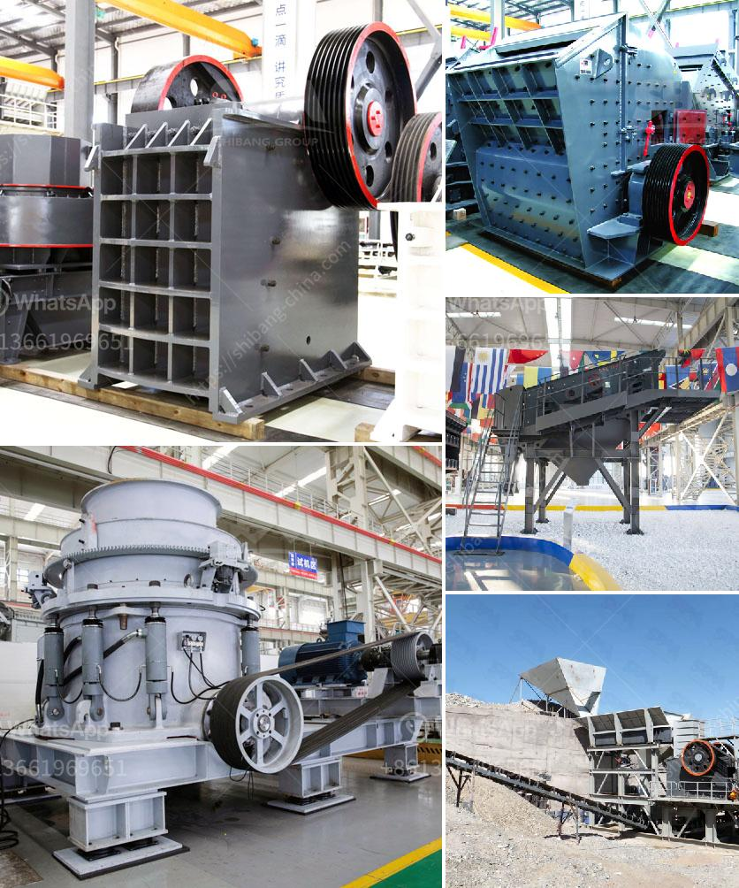

<h3>river sand washed machine</h3>
River sand is a valuable natural resource that is widely used in construction and infrastructure projects. However, before it can be used in various applications, it needs to be processed and cleaned. This is where river sand washed machines come into play. These machines are designed to remove impurities and dust from river sand, making it suitable for use in concrete production, plastering, and other construction activities.

The process of washing river sand involves several steps. First, the sand is fed into a vibrating screen, where any oversized particles are removed. Then, the sand is pumped into a hydrocyclone, which separates the sand from the water and removes any remaining impurities. Finally, the washed sand is discharged onto a conveyor belt, ready for further processing.

There are several advantages to using river sand washed machines. Firstly, they ensure the quality of the sand by removing any unwanted materials. This results in a higher-quality product that meets the required standards for construction applications. Secondly, these machines are highly efficient and can process large quantities of sand in a relatively short period of time. This enables construction projects to progress smoothly and meet their deadlines.

Another benefit of using river sand washed machines is environmental sustainability. By removing impurities from river sand, these machines help to preserve and protect natural resources. Additionally, they reduce the need for excessive mining of sand from riverbeds, which can have detrimental effects on the ecosystem and local communities.

In conclusion, river sand washed machines play a vital role in the construction industry. They ensure the quality of river sand by removing impurities and dust, creating a high-quality product suitable for use in various construction activities. These machines are efficient, environmentally friendly, and help to preserve natural resources. By investing in river sand washed machines, construction companies can improve the quality of their projects while minimizing their impact on the environment.
<h3>Contact us</h3><ul><li><strong>Whatsapp:&nbsp;<a href="https://wa.me/8613661969651">+8613661969651</a></strong></li><li><a href="https://swt.shibang-china.com/?git&amp;zhl&amp;river sand washed machine"><strong>Online Service(chat now)</strong></a></li></ul><h3>Related</h3><ul><li><a href='vertical roller mill.md'>vertical roller mill</a></li><li><a href='granite crusher machine.md'>granite crusher machine</a></li><li><a href='sand hand bentonite grinding mill.md'>sand hand bentonite grinding mill</a></li><li><a href='iron crushing equipment price.md'>iron crushing equipment price</a></li><li><a href='crusher machine cost.md'>crusher machine cost</a></li></ul>