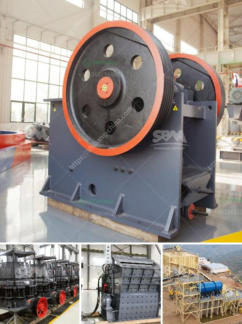

<h3>river stone crushing machine</h3>
River stone is a natural rock formation that is primarily found in river and creek beds. River stones are polished by the constant flow of water over time, creating a smooth, rounded surface. Crushing machines for river stone are machines that are used to crush stones into pieces with different sizes. They are commonly used in river stone crushing plant, artificial sand making plant, and hydraulic desilting plant.

River stone crushing machine includes jaw crusher, impact crusher, cone crusher, and other main equipment. These machines are used to crush river stones into smaller size for further processing. Crushing usually takes place in two or three stages, primary crushing, secondary crushing, and tertiary crushing. Crushing can be done in various ways, including jaw crushers, gyratory crushers, cone crushers, and impact crushers.

Jaw crusher is the most common primary crusher equipment in stone crushing plants. It is often used as the first stage of crushing river stone. Cone crusher and impact crusher are suitable for medium and fine crushing, thus, the system is mainly used for coarse, fine, and medium crushing river stone. This type of crushing machine can crush larger river stones into smaller pieces, making them easier to transport and work with.

Crushing river stones can also be done by sand making machine, which takes advantage of the strong impact, shearing, and grinding forces generated by the high-speed rotating rotor in the crushing cavity. The sand making machine crushes and reshapes the river stone materials through the collision and friction between stones, thus reducing the waste of river stone resources.

The river stone crushing machine is environmentally friendly, with low noise and less dust. The crushing size of the machine can be adjusted according to the requirements of customers. The river stone crushing machine has a wide range of applications, with the characteristics of large crushing ratio, uniform product size, simple structure, reliable operation, simple maintenance, and low operating cost.

In recent years, it has been widely used in various industries such as mining, metallurgy, building materials, highways, railways, water conservancy, and chemical industries. It has become an indispensable equipment for the crushing and processing of river stones.

In conclusion, river stone crushing machines are crucial equipment in river stone processing. The quality of river stone processing equipment is directly related to the output and quality of the final product. Therefore, it is important to make a reasonable selection of river stone crushing equipment. In addition, it is necessary to carry out regular maintenance and repair of the equipment to ensure its stable operation, prolong its service life, and reduce equipment failure and downtime.
<h3>Contact us</h3><ul><li><strong>Whatsapp:&nbsp;<a href="https://wa.me/8613661969651">+8613661969651</a></strong></li><li><a href="https://swt.shibang-china.com/?git&amp;zhl&amp;river stone crushing machine"><strong>Online Service(chat now)</strong></a></li></ul><h3>Related</h3><ul><li><a href='ball miling for lime stone.md'>ball miling for lime stone</a></li><li><a href='stone crushing machine for sale.md'>stone crushing machine for sale</a></li><li><a href='quarry crusher for sale in ghana.md'>quarry crusher for sale in ghana</a></li><li><a href='how to shim a jaw crusher.md'>how to shim a jaw crusher</a></li><li><a href='quarry machines and prices.md'>quarry machines and prices</a></li></ul>