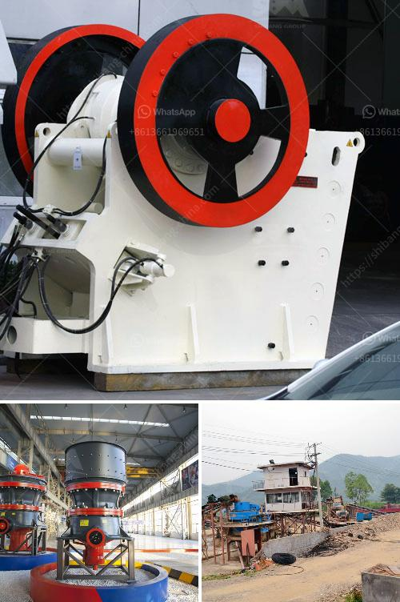

<h3>river stone crushing plant for sale</h3>
River stone is a natural stone found in the fields or river banks. It is an extensively used stone in construction purposes due to its strength and durability. With its abundance, river stone is a cost-effective and valuable resource for construction projects. If you are looking for a river stone crushing plant for sale, there are a few things that you need to consider.

The location of the crushing plant is essential. It should be in close proximity to construction sites where the river stone will be used for construction purposes. This will minimize transportation costs and ensure a continuous supply of crushed stone to fulfill construction requirements.

When purchasing a river stone crushing plant, reliability should be one of the key factors to consider. A reliable crushing plant supplier will have a good reputation for providing high-quality machinery and excellent after-sales support. They should have experienced technicians who can offer guidance during installation, commissioning, and maintenance.

The production capacity of the crushing plant is another crucial aspect to consider. It should have the ability to produce enough crushed stone to meet the demands of the construction project. A production capacity of 100-150 tons per hour is generally considered suitable for medium-scale construction projects.

Moreover, the type of crushing equipment used in the river stone crushing plant is also important. Different types of crushers, such as jaw crushers, cone crushers, impact crushers, and VSI crushers, are available in the market. Each type has its own advantages and can be used for different applications. Jaw crushers are suitable for primary crushing, cone crushers are ideal for secondary crushing, impact crushers are suitable for tertiary crushing, and VSI crushers are used for making sand.

In addition to the crushing equipment, the design of the crushing plant should also be considered. A well-designed plant layout can maximize production efficiency and minimize operating costs. It should include a primary crusher, secondary crusher, and screening equipment to achieve the desired final product size.

When purchasing a river stone crushing plant, it is advisable to conduct a thorough inspection. Check the condition of the crushing equipment and ensure that all components are in good working order. Inspect the electrical system, lubrication system, and hydraulic system to ensure they are functioning properly.

Finally, consider the price of the river stone crushing plant. It is important to compare prices from different suppliers to get the best deal. However, do not compromise on quality for a lower price. Remember, a high-quality crushing plant will provide long-term benefits and a higher return on investment.

In conclusion, a river stone crushing plant for sale is an essential investment for any construction project. It provides a reliable and cost-effective solution for producing high-quality crushed stone. Consider the location, reliability, production capacity, type of crushing equipment, plant design, and price when purchasing a crushing plant. With careful consideration and proper maintenance, the crushing plant will serve as a valuable asset in your construction projects.
<h3>Contact us</h3><ul><li><strong>Whatsapp:&nbsp;<a href="https://wa.me/8613661969651">+8613661969651</a></strong></li><li><a href="https://swt.shibang-china.com/?git&amp;zhl&amp;river stone crushing plant for sale"><strong>Online Service(chat now)</strong></a></li></ul><h3>Related</h3><ul><li><a href='small mobile wash plants for sale.md'>small mobile wash plants for sale</a></li><li><a href='best crushers for manufactured sand.md'>best crushers for manufactured sand</a></li><li><a href='american cone crushers.md'>american cone crushers</a></li><li><a href='special electrodes for ball mill.md'>special electrodes for ball mill</a></li><li><a href='sample of project proposal on small scale mining.md'>sample of project proposal on small scale mining</a></li></ul>