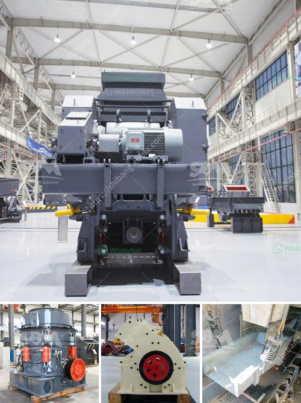

<h3>rock crusher companies</h3>
Rock crushing is a process used in the construction, mining, and aggregate industry. As the name suggests, it involves breaking down rock into fine, small pieces. The process usually involves several stages, including primary crushing, secondary crushing, and screening. In order to carry out this process efficiently, rock crusher companies play a crucial role in the industry.

Rock crusher companies are companies that design, manufacture and distribute rock crushers and other related equipment. They may also build portable crushing plants that include a jaw crusher, cone crusher, and vibrating screen, as well as equipment needed for conveyor belts, feeders, and exclusive service tools.

There are several reputable rock crusher companies which manufacture high-quality rock crushers. These companies understand that every crushing project is unique and requires different equipment. Therefore, they provide various models of rock crushers to suit the specific needs of their customers.

One such reputable company is Company X. With over 50 years of experience in the industry, Company X has earned a strong reputation for their durable and reliable rock crushers. They offer a wide range of crushers, including jaw crushers, cone crushers, and impact crushers. Their equipment is known for its high production capacity, excellent particle shape, and easy maintenance.

Another rock crusher company worth mentioning is Company Y. They have been in the business for over 30 years and have a strong presence in the market. Company Y specializes in designing and manufacturing large, customizable rock crushing machines. Their crushers are known for their robust construction, high reliability, and cost-effectiveness.

Company Z is another noteworthy rock crusher company. For over 20 years, they have been providing customers with advanced rock crushing solutions. They offer both stationary and portable rock crushing equipment, and their products are well-known for their high performance and durability. Additionally, Company Z provides excellent after-sales service, ensuring that their clients' equipment remains in optimal condition.

When choosing a rock crusher company, it is important to consider factors such as the company's reputation, experience, and product performance. It is also essential to evaluate their customer support and after-sales service. A good rock crusher company will have knowledgeable sales representatives who can help their customers choose the right equipment for their specific needs.

In conclusion, rock crusher companies play a vital role in the construction, mining, and aggregate industry. They offer various models of rock crushers to suit the specific requirements of their customers. Reputable companies in this industry, such as Company X, Company Y, and Company Z, provide high-quality rock crushers that are known for their durability and reliability. When selecting a rock crusher company, it is crucial to consider their reputation, experience, and customer support. With the right rock crusher company, construction and mining projects can be executed efficiently and cost-effectively.
<h3>Contact us</h3><ul><li><strong>Whatsapp:&nbsp;<a href="https://wa.me/8613661969651">+8613661969651</a></strong></li><li><a href="https://swt.shibang-china.com/?git&amp;zhl&amp;rock crusher companies"><strong>Online Service(chat now)</strong></a></li></ul><h3>Related</h3><ul><li><a href='new gypsum board plant in india.md'>new gypsum board plant in india</a></li><li><a href='donesia lowongan kerja kuwait cement plant.md'>donesia lowongan kerja kuwait cement plant</a></li><li><a href='marble paving making machinry price.md'>marble paving making machinry price</a></li><li><a href='crusher plant for sale in usa.md'>crusher plant for sale in usa</a></li><li><a href='granite crushing plants.md'>granite crushing plants</a></li></ul>