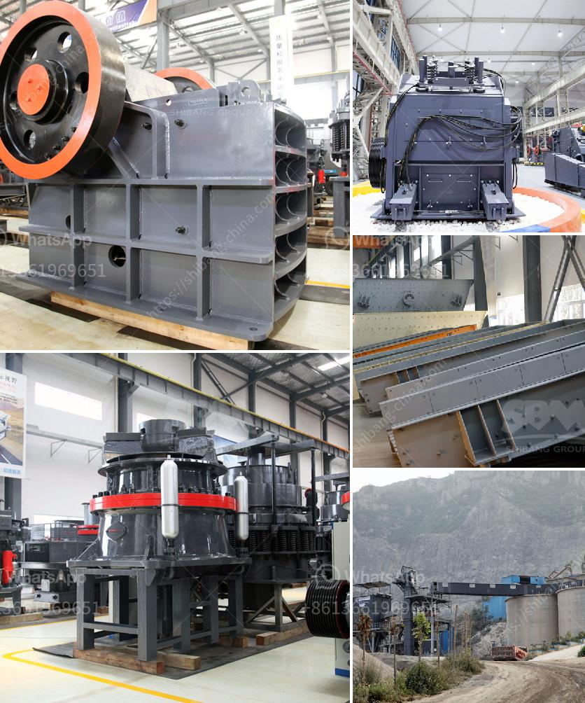

<h3>rock crusher cone</h3>
A rock crusher is a machine designed to break large rocks into smaller rocks, gravel, sand, or rock dust. Crushers are widely used in various industries for crushing different materials, such as metallurgy, mining, building materials, chemicals, and power generation. There are many types of rock crushers, but cone crushers have been the most commonly used equipment for medium to fine crushing due to their ability to grind rocks and maintain a consistent shape.

A rock crusher cone works by squeezing the rock between an eccentrically gyrating spindle, which is covered by a wear-resistant mantle, and an enclosing concave hopper. As the rock enters the crusher from the top, it gets squeezed between the mantle and the concave. The crushing process continues until the rock becomes small enough to pass through the gap between the mantle and concave. The rock is crushed by utilizing the principle of pressure crushing, resulting in the production of smaller-sized rocks.

One of the key advantages of using a cone crusher is its ability to produce a cubical product. Unlike a jaw crusher, which tends to produce mostly flat or elongated particles, cone crushers produce a more uniform cubical shape. This shape is achieved by controlling the crusher's chamber geometry, feed opening, and chamber design. By maintaining a constant flow of material through the crusher, cone crushers ensure a consistent product size distribution.

Another advantage of using a cone crusher is its versatility. Cone crushers can be used for a wide range of applications, including hard rock crushing and ore processing. In the mining industry, cone crushers are used to grind down large rocks into smaller particles for further processing. They can be used in various stages of the crushing process, from primary crushing to the final stage of secondary crushing.

Cone crushers are also known for their efficiency. They are designed to maximize crushing efficiency by reducing the amount of energy required to break down rocks. This is achieved through the use of a steep crushing chamber angle, a long crushing chamber length, and a large eccentricity. These factors result in a high crushing force and a high crushing capacity, allowing cone crushers to process more material per unit of time.

Additionally, cone crushers are known for their durability. They are built to withstand heavy use and harsh operating conditions. The wear-resistant mantle and concave, along with the robust construction of the main frame, ensure that cone crushers can withstand the demands of the toughest applications.

In conclusion, a rock crusher cone is a valuable investment for any business in need of crushing equipment. It provides a versatile and efficient solution for medium to fine crushing, producing a cubical product with a consistent particle size distribution. Additionally, cone crushers are known for their durability and reliability, making them ideal for heavy-duty applications. Whether it's in the mining, construction, or recycling industry, a rock crusher cone can significantly improve the productivity and efficiency of your operation.
<h3>Contact us</h3><ul><li><strong>Whatsapp:&nbsp;<a href="https://wa.me/8613661969651">+8613661969651</a></strong></li><li><a href="https://swt.shibang-china.com/?git&amp;zhl&amp;rock crusher cone"><strong>Online Service(chat now)</strong></a></li></ul><h3>Related</h3><ul><li><a href='ball mill grinding manufacturer in india.md'>ball mill grinding manufacturer in india</a></li><li><a href='mini stone crushing machine.md'>mini stone crushing machine</a></li><li><a href='vertical mill manufacturers.md'>vertical mill manufacturers</a></li><li><a href='crushing machines for ceramic.md'>crushing machines for ceramic</a></li><li><a href='georgia cement mini plant.md'>georgia cement mini plant</a></li></ul>