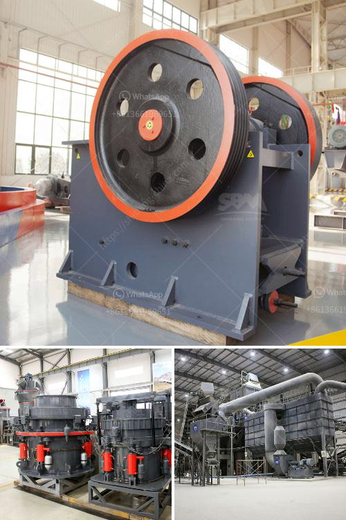

<h3>rock crusher for sale philippines</h3>
Rock crusher for sale Philippines is an important part of the mineral industry in the country. Many industries, such as the construction industry, rely heavily on rock crushers to break down rocks into smaller, more manageable sizes. In fact, rock crushers are essential in various construction and mining activities.

There are different types of rock crushers available in the market, including jaw crushers, cone crushers, impact crushers, and roll crushers. Each type has its own advantages and uses. However, regardless of the type, the primary purpose of a rock crusher is to break down large rocks into smaller, more manageable sizes for further processing.

One of the main advantages of a rock crusher for sale Philippines is its mobility. With a mobile crusher, you can easily move it to various sites or locations, allowing you to work on different projects without any hassle. This is especially beneficial for construction companies that have multiple projects simultaneously. Additionally, a mobile crusher can be easily transported to remote areas or difficult terrains, where traditional crushers may not be feasible.

Another advantage of a rock crusher for sale Philippines is its low operating costs. Many crushers in the Philippines require frequent maintenance and repairs, which can be costly. However, with a rock crusher, you won't have to worry about these issues. These machines are designed to be durable and reliable, requiring minimal maintenance and repairs. This translates to lower operating costs and increased productivity for your business.

Furthermore, a rock crusher for sale Philippines allows you to crush a variety of materials, making it applicable for various industries. Whether you need to crush aggregates, limestone, granite, or any other type of material, a rock crusher can do it all. This versatility is crucial in many construction projects, as different materials have different properties and requirements.

Moreover, a rock crusher for sale Philippines is easy to use and operate. Unlike complicated machinery, these machines are designed to be user-friendly, allowing even those with little to no experience to operate them efficiently. This means you won't have to spend a significant amount of time and resources training your employees.

When looking for a rock crusher for sale Philippines, it's essential to do your research and find a reliable supplier. Make sure to choose a supplier that offers high-quality machines, excellent customer service, and competitive prices. Additionally, consider any additional features or accessories that may be necessary for your specific needs.

In conclusion, a rock crusher for sale Philippines is an essential piece of equipment in the construction and mining industries. With its versatility and mobility, it allows you to crush various materials efficiently, making it a valuable asset for your business. Ensure to find a reputable supplier to ensure the quality and reliability of the rock crusher.
<h3>Contact us</h3><ul><li><strong>Whatsapp:&nbsp;<a href="https://wa.me/8613661969651">+8613661969651</a></strong></li><li><a href="https://swt.shibang-china.com/?git&amp;zhl&amp;rock crusher for sale philippines"><strong>Online Service(chat now)</strong></a></li></ul><h3>Related</h3><ul><li><a href='dolomite powder mesh.md'>dolomite powder mesh</a></li><li><a href='ballast processing plant.md'>ballast processing plant</a></li><li><a href='talcum powder manufacturing process.md'>talcum powder manufacturing process</a></li><li><a href='business plan for small scale gold processing plant.md'>business plan for small scale gold processing plant</a></li><li><a href='rock crusher plant operations manager.md'>rock crusher plant operations manager</a></li></ul>