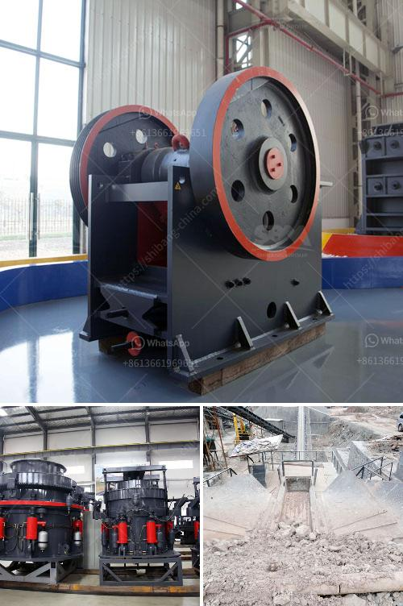

<h3>rock crusher in dubai</h3>
Rock music has always been the epitome of rebellion, freedom, and passion. It is a genre that resonates with people across the globe, and Dubai is no exception. In recent years, the city has seen a rise in the popularity of rock music, with more and more bands emerging and demanding a platform to showcase their talents. Enter the rock crusher in Dubai.

A rock crusher is a machine designed to reduce the size of large material (like rocks and stone) into smaller aggregate such as gravel, recycled concreate, crushed stone, or dust. Large mining operations can often use more than one crusher. Construction projects are also heavy users of these machines and the materials they produce. Rock crushers are an essential piece of equipment in many industries, including mining, construction, demolition, recycling, and more.

Dubai, being a hub of economic activity and development, is no stranger to heavy machinery and construction equipment. The rock crusher in Dubai is essential for the construction industry as it helps reduce the cost of materials, making it more affordable for the city to undertake large-scale projects. Additionally, the rock crusher is essential for recycling efforts as it enables the reuse of concrete crushed into gravel, reducing the need for new construction materials and minimizing the impact on the environment.

One of the leading suppliers of rock crushers in Dubai is Euro Gulf Machinery. Euro Gulf Machinery is a reliable partner for a range of heavy equipment needs in the construction, demolition, and mining industries. With their extensive knowledge and experience, they provide customers in Dubai and the surrounding areas with top-quality rock crushers that meet their specific requirements.

The versatility of rock crushers allows them to handle a variety of materials. From the hardest rocks to softer ones, a rock crusher in Dubai can handle it all. Whether it's limestone, granite, or any other material, the machine efficiently crushes it into the desired aggregate size. This ensures that construction projects proceed smoothly and on schedule, as contractors have a readily available supply of high-quality materials.

Rock crushers in Dubai have revolutionized the construction industry and made it possible to complete projects faster, more efficiently, and at a lower cost. The durability and reliability of these machines are unparalleled, making them an essential investment for any company involved in construction, mining, or recycling.

In conclusion, the rock crusher in Dubai is an essential piece of equipment that ensures the smooth completion of construction projects. It reduces the cost of materials, promotes recycling, and provides a reliable source of high-quality aggregate. With Euro Gulf Machinery leading the way, Dubai's construction industry can rely on top-quality rock crushers to meet their needs. Rock music may be renowned for its rebellious nature, but when it comes to construction, the rock crusher is a reliable ally that gets the job done.
<h3>Contact us</h3><ul><li><strong>Whatsapp:&nbsp;<a href="https://wa.me/8613661969651">+8613661969651</a></strong></li><li><a href="https://swt.shibang-china.com/?git&amp;zhl&amp;rock crusher in dubai"><strong>Online Service(chat now)</strong></a></li></ul><h3>Related</h3><ul><li><a href='mill price of hammer mill.md'>mill price of hammer mill</a></li><li><a href='used ball mill for calcium carbonate sell india.md'>used ball mill for calcium carbonate sell india</a></li><li><a href='quicklime production process.md'>quicklime production process</a></li><li><a href='hammer mill mesin impor china.md'>hammer mill mesin impor china</a></li><li><a href='jaw crusher saudi price.md'>jaw crusher saudi price</a></li></ul>