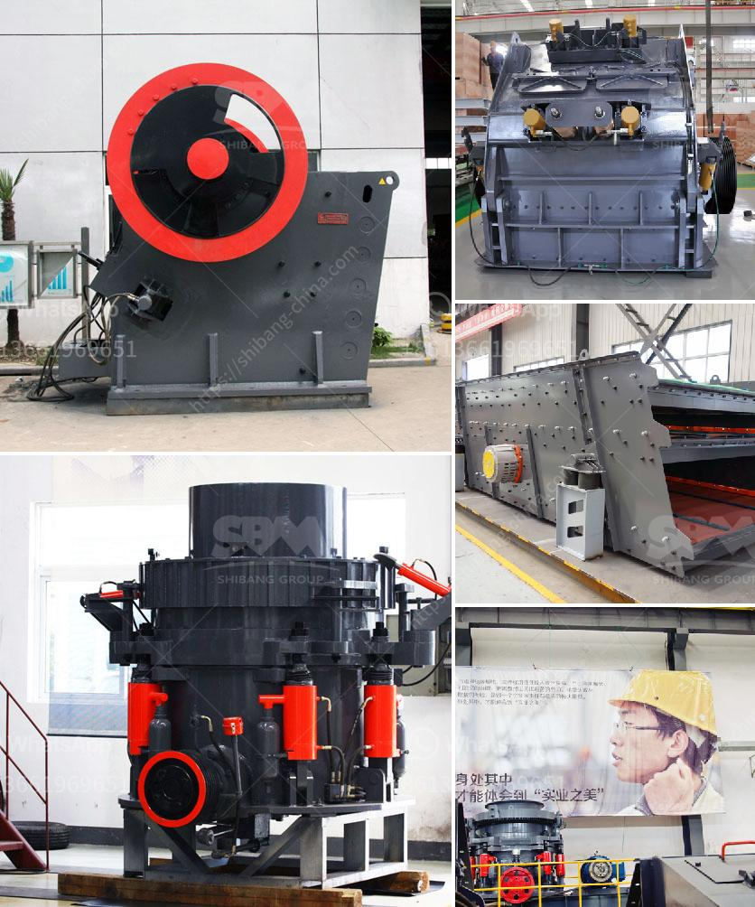

<h3>rock crusher in ghana</h3>
With the development of construction industry in Ghana, there are more and more customers invest in mining. As for the abundant mineral resources in Ghana, mining enthusiasts would like to engage in ore mining and processing industry for a profit. For the mining industry, investing in Ghana gold ore crushing plant is a wise choice.

Markup Mining is specialized in producing mining crushing and powder equipment. Based on the back-breaking theory, the company introduced a new series of rock crushing equipment that is called mobile stone crusher machine. It provides an efficient and low-cost operation project for customers in the mining industry.

Rock crushers have a wide range of suitable material to choose from, whether it’s soft or hard, or even very hard, rock crushers can reduce those large rocks into smaller rocks, gravel, or even rock dust. Here are some typical materials that break or compress by industry crushers, such as limestone, quartz stone, diabase, gravel, granite, cobblestone, etc. By using a rock crusher, rake and granular gravel, customers can get finer and better-quality aggregates in Ghana.

The mobile rock crusher we sell is characterized by the advantages of high performance, high reliability, attractive appearance and others. It will be a good partner for gold processing plants, construction waste disposal plants and other mining and crushing plants in Ghana.

Ghana is second only to South Africa in gold production in Africa. Gold mines in Ghana are rich and characterized by large reserves. Therefore, the Ghana mining industry is quite prosperous. Gold mining industry in Ghana is still a very attractive investment for the investors. The country's gold capacity is incredible, and mines reserves can reach about 2 trillion.

According to the Ghana Geological Survey, refined gold production rose to 283 tons in 2019 from 80 tons in 2008. In recent years, Ghana has made tremendous progress in gold mining sector by increasing the number of active mines, promoting fiscal discipline, and attracting investment.

Rock Crusher is one of the most important pieces of equipment in a quarry, gravel plant, concrete, or asphalt recycling industry. It reduces the size of large pieces of rock into smaller pieces that can be used in construction projects or other purposes.

Many crushers available today on the market are designed for jaw crushers. They can crush rocks down to various sizes, from pebbles to fine gravel. However, if you need a machine that can simultaneously crush and screen the materials into even finer sizes, the cone crusher is the best choice.

Ghana is rich in gold ore resources, and rock crusher machines can play a great role in mining industry. Investors buy rock crusher in Ghana to gather gold ore. However, different types of rock crushers have different performances and different prices. So, it is important for mining investors to choose the most suitable rock crusher based on the properties of raw materials and the specific requirements. No matter which type of rock crusher they choose, it will bring significant profits for them in the long run.
<h3>Contact us</h3><ul><li><strong>Whatsapp:&nbsp;<a href="https://wa.me/8613661969651">+8613661969651</a></strong></li><li><a href="https://swt.shibang-china.com/?git&amp;zhl&amp;rock crusher in ghana"><strong>Online Service(chat now)</strong></a></li></ul><h3>Related</h3><ul><li><a href='crushing plants south africa.md'>crushing plants south africa</a></li><li><a href='tanzania stone crusher machine.md'>tanzania stone crusher machine</a></li><li><a href='crusher plant in philippines.md'>crusher plant in philippines</a></li><li><a href='list of price of stone crusher machine in zimbabwe.md'>list of price of stone crusher machine in zimbabwe</a></li><li><a href='raymond grinding mill germany.md'>raymond grinding mill germany</a></li></ul>