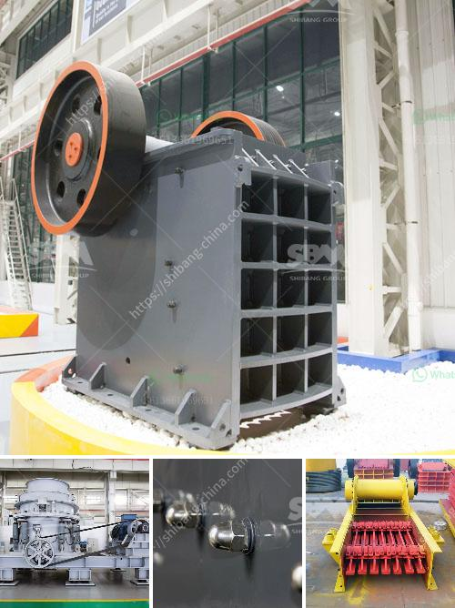

<h3>rock crusher machine for sale philippines</h3>
Rock crusher machine for sale in Philippines is mainly used to crush kinds of mining stones primarily, and the largest compression resistance of the material to be crushed is 320MPa. The rock crusher machine for sale in Philippines is widely used in many industries such as mining, metallurgy, building material, highway, railway, water conservancy, and chemical industry. All kinds of rock crushing machine can be divided into stationary crusher and mobile crushing plant.

In Philippines, explosive or drilling machines are used to drill holes into the rocks in order to insert explosives which will blast the rock into smaller pieces. In order to produce a usable end-product, the crushed rock has to be screened into various size categories. Crushed rock that is too large for the desired size will be broken again by the rock crusher machine until it is small enough.

With the rise of national infrastructure, construction, the demand for sand and gravel aggregates is increasing. The Philippines is a country rich in natural resources, rich in river resources, and has high-quality aggregate mines. Following the continuous development of the infrastructures such as highways, railways, and high-rise buildings in the Philippines, sand and gravel production plants have also increased and the requirements for rock crushing machines have risen accordingly.

In the Philippines, a wide range of rock crusher machines are available for sale. Manufacturers such as Aimix Group, who is one of the leading and reputable rock crushing machine suppliers in the world, offers different types of rock crushers for sale in the Philippines. These rock crushing machines can be used in various industries including mining industry, where they are utilized to break down bigger rocks into smaller sizes for further processing. Some of the popular rock crusher types are jaw crusher, cone crusher, vertical shaft impact crusher, gyratory crusher, and mobile crusher.

To get the desired rock size, the rock crusher machine works by using mass force to crush rocks into smaller stones. It is equipped with hammers or blow bars to impact the rock, and then the rocks will be thrown against the plates or anvils to break them into smaller pieces.

The rock crusher machine for sale can be designed with different types of features to meet the specific rock crushing needs of customers. According to different crushing principles and particle sizes, it can be divided into many types like jaw crusher, cone crusher, impact crusher, gyratory crusher, compound crusher, roller crusher, etc.

The rock crusher machine for sale in Philippines is available in stationary, portable and mobile applications. The crushing plant for sale in the Philippines has a wide application on mining, smelting, building materials, highways, railways, water conservancy, chemical industries, and other industries.

When you find a suitable rock crusher machine for sale in Philippines, the next step is to choose the specific model of the rock crusher machine. The most effective method is to consult the technician of the crushing plant supplier and choose a suitable model according to your own needs.

In conclusion, the rock crusher machine for sale in the Philippines is now increasingly popular. It is widely used in various industries, such as mining, metallurgy, building materials, transportation, chemical industry, water conservancy, and so on. It has the ability to crush rocks into smaller sizes and create specific aggregates for construction purposes. Whether you need a stationary or mobile rock crusher machine, it is readily available in the Philippines market.
<h3>Contact us</h3><ul><li><strong>Whatsapp:&nbsp;<a href="https://wa.me/8613661969651">+8613661969651</a></strong></li><li><a href="https://swt.shibang-china.com/?git&amp;zhl&amp;rock crusher machine for sale philippines"><strong>Online Service(chat now)</strong></a></li></ul><h3>Related</h3><ul><li><a href='harga mesin sekunder stone crusher bekas.md'>harga mesin sekunder stone crusher bekas</a></li><li><a href='gold mining machine from germany.md'>gold mining machine from germany</a></li><li><a href='calculation of crushing plant.md'>calculation of crushing plant</a></li><li><a href='price of a large mobile crusher.md'>price of a large mobile crusher</a></li><li><a href='price of crushing machine.md'>price of crushing machine</a></li></ul>