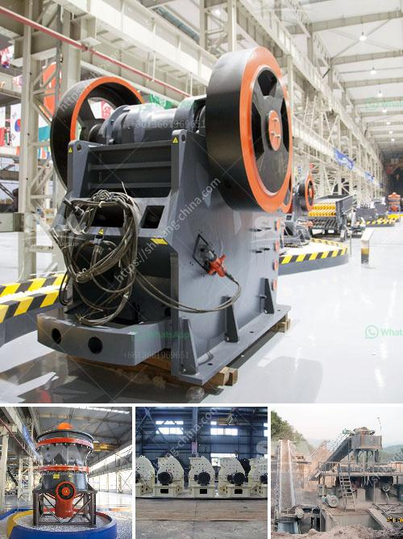

<h3>rock crusher machine in malaysia</h3>
Rock crusher machine in Malaysia is manufactured from Shanghai Xuanshi,It is the main mineral processing solutions. XSM stone crushing machine project-rock crusher machine in Malaysia

Shanghai XSM (rock crusher machine in Malaysia) are a professional production of stone crushing machine.Sales and Widely used in Europe, South America, Africa, East Asia and Asia region.

XSM production of stone crusher: jaw crusher, impact crusher, cone crusher, hammer crusher and mobile crusher, stone crusher is mainly applied to soft or hard and extremely hard materialscrushing, plastic, widely used in various ores, cement, refractories, aluminum where the soil clinker, carborundum, glass raw materials, mechanism building sand, stone and a variety of metallurgical slag. 

Rock crusher machine in Malaysia mainly screen for customers. In Malaysia, jaw crusher is the essential quarry equipment and mine ore crusher machine in Malaysia. XSM jaw crusher is employed as primary crusher and cone crusher is utilized as secondary crusher. Along with the vibrating screen, these crushers provide a whole stone crushing plant for making sand and stone. The rock crusher functions incredibly properly in Malaysia as a result of perfect characteristics of our rock crusher. We offer a whole range of services such as: process design, mineral beneficiation equipment, technical support, after-sale service, etc.

The field-proven cone crusher combines the state-of-the-art technologies to provide the highest capacity, the best product shape, the highest on-spec yield, easy automation, and the greatest possible reliability and flexibility. All to help you achieve the highest possible level of profitability. Small rock crushing equipment for sale PE jaw crusher, HP cone crusher, PF impact crusher for small rock crushing operation.

XSM is a professional mineral crushing machine manufacturer from China and our company has established good cooperation relationship with Africa countries, such as Zimbabwe, South Africa, and Uganda and so on. Our mining machines have helped local mining operators get much profit. Based on over 20 years' production experience, XSM has produced high quality and advanced mining machines for sale, crushing machine, grinding machine and beneficiation equipment.

No matter where you are, we are here to help. Whether you need technical advice, project proposals, or a comprehensive service, we are ready to assist you with knowledgeable and professional team. Please feel free to contact us. 
<h3>Contact us</h3><ul><li><strong>Whatsapp:&nbsp;<a href="https://wa.me/8613661969651">+8613661969651</a></strong></li><li><a href="https://swt.shibang-china.com/?git&amp;zhl&amp;rock crusher machine in malaysia"><strong>Online Service(chat now)</strong></a></li></ul><h3>Related</h3><ul><li><a href='how much crusher plant cost.md'>how much crusher plant cost</a></li><li><a href='for selection of coal mill.md'>for selection of coal mill</a></li><li><a href='clinker production process.md'>clinker production process</a></li><li><a href='cone crusher factory south africa.md'>cone crusher factory south africa</a></li><li><a href='crawler type mobile crusher plant.md'>crawler type mobile crusher plant</a></li></ul>