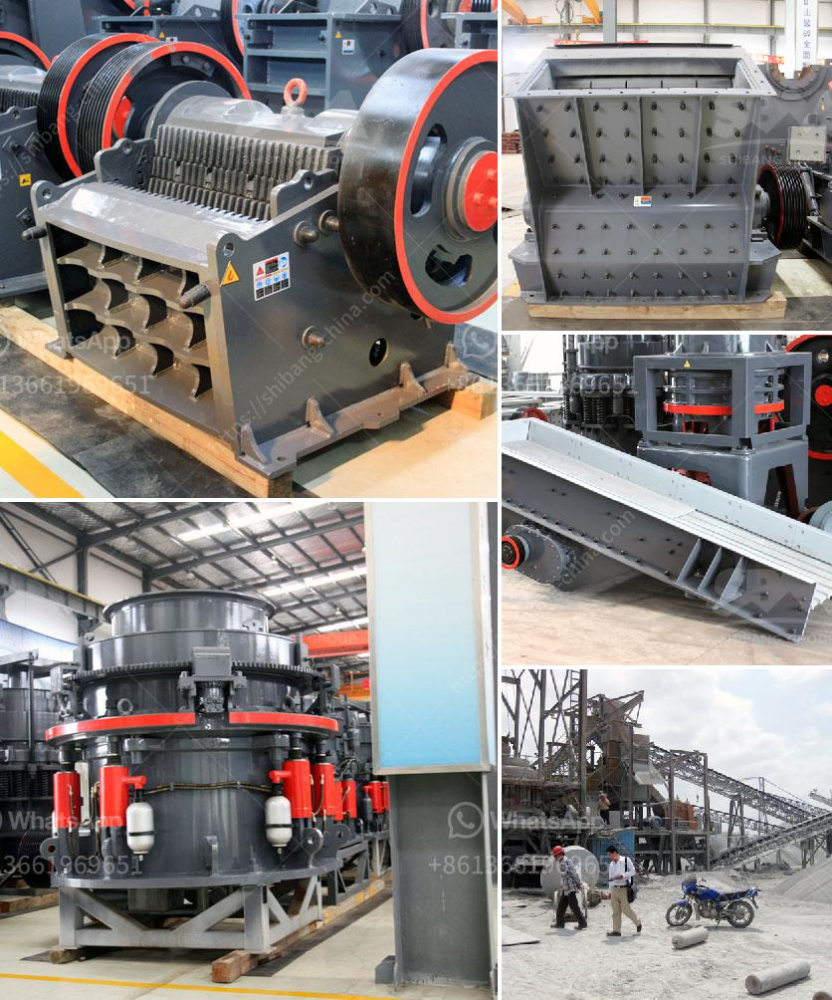

<h3>rock crusher machine price in india</h3>
India is rich in mineral resources, making it a producer of various types of stone crushers, including jaw crusher, cone crusher, impact crusher, hammer crusher, gyratory crusher and roller crusher. Among these, the jaw crusher is the most commonly used primary crushing equipment for rocks and minerals processing in metallurgy, building materials, highways, railways, water conservancy, and chemical industries.

The rock crusher machine price in India is influenced by various factors, such as the features, input size, output size, and the capacity. With the increasing operation costs, reducing operation costs becomes essential. There are many manufacturers and suppliers of stone crushing machines in India. They sell their products at different price ranges depending on the quality, capacity, and features of the machines.

Choosing a reliable and professional supplier is critical to ensure that the machine operates efficiently and has a long service life. One of the factors that affect the machine's price is the brand reputation. A well-known brand with a good reputation for quality and after-sales service tends to have a higher price compared to unknown brands. However, investing in a reputable brand can save you money in the long run due to the lower maintenance and repair costs.

Another factor that affects the price is the machine's configuration. Different configurations have different prices. For example, a machine with a higher capacity and more advanced technology will be more expensive than a basic model. Therefore, it is essential to determine your specific requirements and select the appropriate configuration that meets your needs. It is recommended to consult with professionals who can provide you with expert advice on the suitable configuration.

The input size and output size also play a role in determining the machine price. If you have large rocks or minerals that need to be crushed into smaller sizes, a machine with a high crushing ratio and large feeding size is more suitable. On the contrary, if you only need to crush small-sized rocks or minerals, a machine with a smaller capacity may be sufficient and more cost-effective.

In addition to the machine itself, other costs such as transportation, installation, and maintenance should be considered. Some suppliers may provide these services as part of the package, while others may charge extra. It is crucial to clarify these details with the supplier before making a purchase to avoid any unexpected expenses.

In conclusion, when considering the price of a rock crusher machine in India, it is essential to take into account factors such as brand reputation, machine configuration, input size, output size, and additional costs. By evaluating these aspects, you can make an informed decision and choose a machine that provides the best value for your investment. Remember to compare prices from different suppliers to ensure you get a competitive deal without compromising on quality and performance.
<h3>Contact us</h3><ul><li><strong>Whatsapp:&nbsp;<a href="https://wa.me/8613661969651">+8613661969651</a></strong></li><li><a href="https://swt.shibang-china.com/?git&amp;zhl&amp;rock crusher machine price in india"><strong>Online Service(chat now)</strong></a></li></ul><h3>Related</h3><ul><li><a href='mobile crushing plant 10x36 cost.md'>mobile crushing plant 10x36 cost</a></li><li><a href='barite powder manufacturing machinery.md'>barite powder manufacturing machinery</a></li><li><a href='project cost estimation for iron ore pellet plant.md'>project cost estimation for iron ore pellet plant</a></li><li><a href='sand wash plant for sale in india.md'>sand wash plant for sale in india</a></li><li><a href='stone crusher plant best granite stone crushers.md'>stone crusher plant best granite stone crushers</a></li></ul>