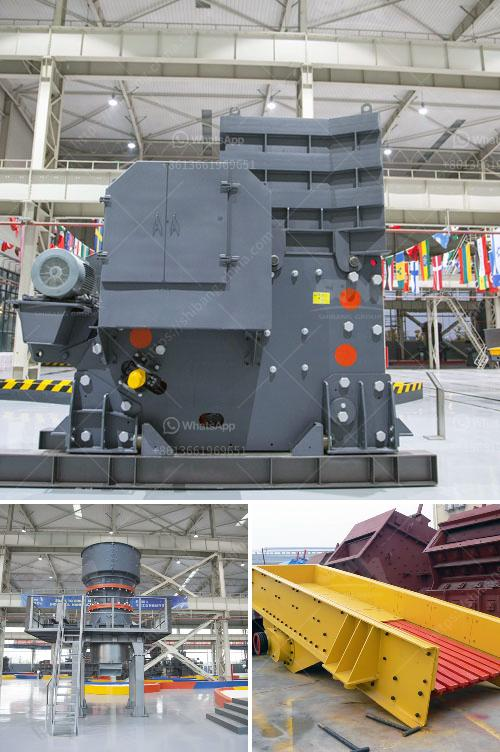

<h3>rock crusher machine</h3>
When it comes to construction sites, there are many things that need to be dealt with. Demolition or excavation, materials are needed to be crushed or shredded in order to produce a usable product for construction purposes. One such machine that helps in reducing the size and improving the quality of the material is a rock crusher machine.

Rock crusher machines are widely used in construction sites for reducing the size of rocks and stones. It is commonly known as a stone crusher, which is used to crush large stones into smaller ones. The rock crusher machine works by using high-speed rotating impeller blades that are powered by a motor. Crushing rocks or stones results in better quality material for construction purposes.

There are several advantages of using rock crusher machines in construction sites. Firstly, it reduces the cost of transporting materials as the crushed or shredded material can be easily transported to the required location. Instead of shifting huge rocks, the crusher machines can break them into smaller sizes, allowing for easy transportation in trucks or other hauling vehicles.

Secondly, rock crusher machines increase productivity on construction sites. With the help of these machines, the time and effort required for crushing rocks or stones manually is eliminated. This allows workers to focus on other tasks, thereby maximizing productivity. Also, the uniformity and consistency of the crushed material is maintained, leading to better quality construction work.

Furthermore, the rock crusher machines are environmentally friendly. They help in reducing the amount of waste material generated during construction activities. The crushed or shredded material can be used as backfill or as aggregate in concrete production, reducing the need for fresh extraction of raw materials. This contributes to the conservation of natural resources and reduces environmental impact.

Rock crusher machines are available in a variety of models, sizes, and capacities to meet the demands of different construction projects. Some machines are portable and can be easily transported to multiple job sites. They are designed to be versatile and durable, capable of handling different types of rocks, stones, or other materials.

In conclusion, rock crusher machines play a crucial role in construction projects. They help in reducing the size of rocks or stones, improving the quality of the material, and increasing productivity on construction sites. These machines are environmentally friendly, contributing to the conservation of natural resources. With their variety of models and capacities, rock crusher machines are a valuable asset for any construction site.
<h3>Contact us</h3><ul><li><strong>Whatsapp:&nbsp;<a href="https://wa.me/8613661969651">+8613661969651</a></strong></li><li><a href="https://swt.shibang-china.com/?git&amp;zhl&amp;rock crusher machine"><strong>Online Service(chat now)</strong></a></li></ul><h3>Related</h3><ul><li><a href='mobile crusher in codelco.md'>mobile crusher in codelco</a></li><li><a href='small jaw crusher.md'>small jaw crusher</a></li><li><a href='copper ore melting machines.md'>copper ore melting machines</a></li><li><a href='trackmounted equipment.md'>track-mounted equipment</a></li><li><a href='puzzolana 200 tph cone crusher plant price.md'>puzzolana 200 tph cone crusher plant price</a></li></ul>