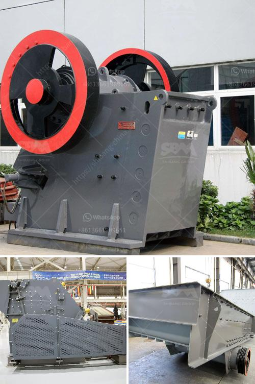

<h3>rock crusher plant operations manager</h3>
The role of the operations manager in a rock crusher plant plays a vital role in ensuring efficient and effective operations throughout the entire plant. The manager must ensure that the plant meets all requirements set by the budget and profit margins, and that both production levels and quality targets are met. It is a demanding role that requires a mix of both technical expertise and leadership skills.

One of the key responsibilities of the operations manager is to oversee the entire production process. This involves coordinating and managing various departments within the plant, such as the crushing, screening, and washing departments. The manager is responsible for ensuring that all equipment is properly maintained and running smoothly, and that any breakdowns or malfunctions are addressed in a timely manner.

In addition to overseeing the production process, the operations manager is also responsible for managing the plant’s workforce. This involves recruiting, training, and motivating employees, as well as monitoring their performance and addressing any issues or concerns that arise. The manager must also ensure that all employees are following safety protocols and that the plant is in compliance with all relevant regulations and standards.

Another important aspect of the operations manager’s role is to analyze plant performance and make recommendations for improvements. This may involve analyzing production data, identifying bottlenecks or inefficiencies, and implementing strategies to increase productivity and reduce costs. The manager may also be involved in developing and implementing new processes or technologies to improve overall plant performance.

A successful operations manager in a rock crusher plant must also possess strong leadership skills. They must be able to effectively communicate with employees at all levels of the organization, as well as with suppliers, contractors, and other stakeholders. They must be able to motivate and inspire employees to achieve and exceed production targets, while also fostering a positive and safe work environment.

In summary, the operations manager of a rock crusher plant plays a vital role in ensuring the smooth operation of the plant and meeting production goals. They must oversee the entire production process, manage the workforce, analyze plant performance, and make recommendations for improvements. It is a challenging and demanding role that requires a mix of technical expertise and leadership skills. However, with the right skills and experience, an operations manager can contribute significantly to the success of a rock crusher plant.
<h3>Contact us</h3><ul><li><strong>Whatsapp:&nbsp;<a href="https://wa.me/8613661969651">+8613661969651</a></strong></li><li><a href="https://swt.shibang-china.com/?git&amp;zhl&amp;rock crusher plant operations manager"><strong>Online Service(chat now)</strong></a></li></ul><h3>Related</h3><ul><li><a href='calculation of crushing plant.md'>calculation of crushing plant</a></li><li><a href='brand crusher machine in malaysia.md'>brand crusher machine in malaysia</a></li><li><a href='mini cement plant project report of cost setting in india.md'>mini cement plant project report of cost setting in india</a></li><li><a href='china granite crusher.md'>china granite crusher</a></li><li><a href='granite crusher machine.md'>granite crusher machine</a></li></ul>