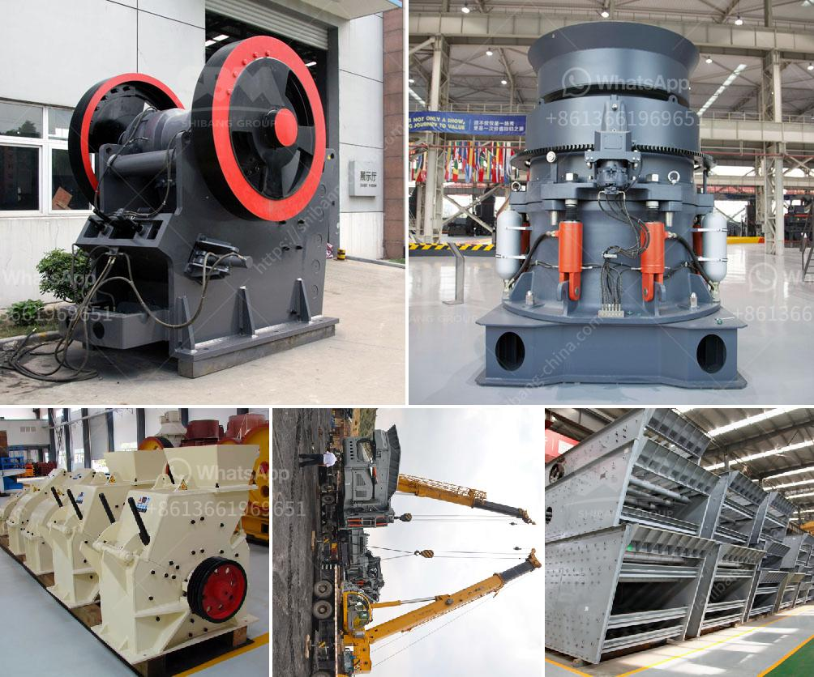

<h3>rock crusher production screen mesh</h3>
The rock crusher is an essential equipment in mining and mineral industries. It is used to break large rocks into small pieces so that valuable minerals can be extracted from them. Rock crushing operations generate a lot of material that needs to be filtered and separated. To achieve this, a reliable and durable screen mesh is required.

The screen mesh is a key component of rock crushers. It is responsible for separating the crushed material into different sizes, thereby ensuring the end product meets specific requirements. The efficiency and productivity of a rock crusher largely depend on the quality and performance of its screen mesh.

One of the crucial factors to consider when choosing a rock crusher production screen mesh is its aperture size. The aperture size determines the size of the particles that can pass through the screen. In rock crushing operations, different sizes of crushed material are required for various applications. Therefore, having a screen mesh with appropriate aperture sizes ensures that the desired sizes of crushed material can be produced efficiently.

Another important aspect of a rock crusher production screen mesh is its durability. The screen mesh is subjected to continuous wear and tear due to the abrasive nature of the materials being processed. It is essential to choose a screen mesh that can withstand such harsh conditions and has a long lifespan. A durable screen mesh not only reduces downtime for replacements but also improves the overall productivity of the rock crusher.

The material used to manufacture the screen mesh also plays a significant role in its performance. Different materials have varying resistance to wear and corrosion. Stainless steel is commonly used for rock crusher production screen mesh due to its high strength and excellent resistance to corrosion and wear. Additionally, stainless steel mesh is easy to clean and maintain, ensuring the screen remains effective throughout its lifespan.

Aside from durability and material quality, the design of the screen mesh also affects its efficiency. The pattern of the mesh openings should be carefully designed to maximize the screening process. A well-designed screen mesh allows for effective and efficient separation of materials, resulting in higher productivity and higher-quality end products.

In conclusion, the choice of rock crusher production screen mesh is crucial for enhancing efficiency and productivity. It is essential to select a screen mesh with the appropriate aperture size that matches the desired product specifications. Durability is also a key consideration to ensure longer lifespan and reduced downtime for replacements. Additionally, the material and design of the screen mesh should be optimized for efficient material separation. By investing in a high-quality screen mesh, operators can improve the overall performance and maximize the output of their rock crusher.
<h3>Contact us</h3><ul><li><strong>Whatsapp:&nbsp;<a href="https://wa.me/8613661969651">+8613661969651</a></strong></li><li><a href="https://swt.shibang-china.com/?git&amp;zhl&amp;rock crusher production screen mesh"><strong>Online Service(chat now)</strong></a></li></ul><h3>Related</h3><ul><li><a href='vibrator machine for concrete.md'>vibrator machine for concrete</a></li><li><a href='jaw crusher process description.md'>jaw crusher process description</a></li><li><a href='aggregate crusher supplier.md'>aggregate crusher supplier</a></li><li><a href='second hand mobile crushers and screens south africa.md'>second hand mobile crushers and screens south africa</a></li><li><a href='price list of used stone crushers in kenya.md'>price list of used stone crushers in kenya</a></li></ul>