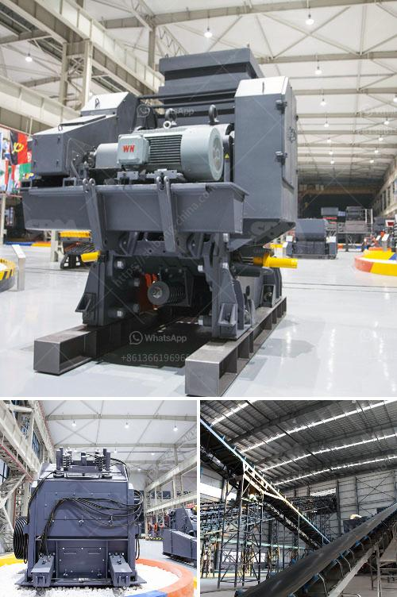

<h3>rock crusher saudi arabia</h3>
Rock crushers are a fundamental part of almost every construction project, lighting the way to a successful completion. For a structure to be sound and stable, rock crushers are indispensable tools that allow the construction teams to selectively and effortlessly pulverize rocks, stones, and pebbles. With their help, construction professionals can effortlessly break down large rocks into smaller, more manageable pieces, enhancing efficiency and productivity at the job site. One of the leading rock crusher manufacturers in the world, Metso Minerals, offers versatile and highly efficient rock crushers suitable for all stages of crushing, from primary to quaternary.

Saudi Arabia, as one of the leading countries in the production of construction materials, is no stranger to the need for rock crushers. The kingdom hosts numerous rock quarries where construction companies can source their aggregate needs for road and building construction. With the ever-increasing demand for these materials, the need for efficient rock crushers to facilitate the process becomes more crucial.

Rock crushers used for crushing rocks and stones to produce aggregates are characterized by heavy-duty machines with high energy consumption and low operational efficiency. As technology advances, there is a need for reduced energy consumption, increased operational flexibility, and improved process control. This is where modern rock crushers, such as those manufactured by Metso Minerals, excel.

Metso Minerals' rock crushers are designed to provide a comprehensive solution for rock crushing applications. Their advanced features ensure high productivity, easy maintenance, and low operational costs. With hydraulic adjustment, automatic tramp relief, and fully hydraulic crusher setting, the rock crushers can efficiently handle various rock types and produce a wide range of aggregate sizes.

One of the significant advantages of Metso Minerals' rock crushers is their adaptability to different crushing stages. Whether it is a primary, secondary, tertiary, or even quaternary rock crushing application, their crushers can efficiently handle the task. This flexibility allows construction professionals to optimize their operations and ensure an uninterrupted supply of construction materials.

Additionally, Metso Minerals' rock crushers incorporate advanced automation and control systems that provide real-time monitoring and control of the crushing process. With features such as crusher optimization, remote monitoring, and automated control, operators can maximize the crushers' performance while minimizing downtime and ensuring optimal operational efficiency.

In conclusion, rock crushers are indispensable tools in the construction industry, providing the necessary rock crushing capabilities that facilitate the production of high-quality aggregates. Metso Minerals' rock crushers are designed to offer maximum productivity, flexibility, and cost-effectiveness. As Saudi Arabia continues to invest in infrastructure projects, rock crushers will be a key component in the construction process, ensuring that rocks, stones, and pebbles can be selectively pulverized and transformed into valuable construction materials. Investing in efficient and reliable rock crushers is not only a necessity but also a smart move for construction companies looking to thrive in the competitive market.
<h3>Contact us</h3><ul><li><strong>Whatsapp:&nbsp;<a href="https://wa.me/8613661969651">+8613661969651</a></strong></li><li><a href="https://swt.shibang-china.com/?git&amp;zhl&amp;rock crusher saudi arabia"><strong>Online Service(chat now)</strong></a></li></ul><h3>Related</h3><ul><li><a href='magnetic separator manufacturers in turkey.md'>magnetic separator manufacturers in turkey</a></li><li><a href='cost estimate ball mill.md'>cost estimate ball mill</a></li><li><a href='nigeria stone grinder mill.md'>nigeria stone grinder mill</a></li><li><a href='specification of a ball mill.md'>specification of a ball mill</a></li><li><a href='rock crusher production screen mesh.md'>rock crusher production screen mesh</a></li></ul>