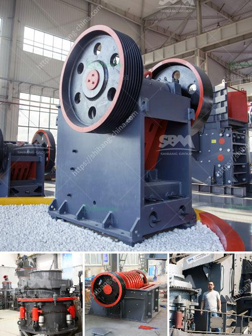

<h3>rock crusher suppliers</h3>
Rock crushers are used in a wide range of industries, from mining to construction to recycling. Rock crushers are machines designed to reduce large rocks into smaller rocks, gravel, or rock dust. These machines can efficiently break down rock materials into different sizes, reducing the need for further processing, making them a crucial tool in the construction of buildings, roads, bridges, and other infrastructure projects.

When it comes to purchasing rock crushers, finding reliable and reputable suppliers is essential. With numerous suppliers available in the market, it can be overwhelming to determine which one offers the best products and services. In this article, we will discuss some key factors to consider when selecting rock crusher suppliers.

First and foremost, it is crucial to ensure that the rock crusher supplier has a good reputation in the industry. You can do this by researching online, reading reviews, and seeking recommendations from industry professionals or colleagues. A supplier with a proven track record of delivering high-quality rock crushers and exceptional customer service is more likely to meet your expectations.

Another factor to consider is the range of rock crushers offered by the supplier. Different applications may require specific types of rock crushers. Therefore, it is important to choose a supplier that offers a wide variety of crushers to cater to your specific needs. Whether you require a jaw crusher, cone crusher, or impact crusher, the supplier should have a diverse inventory to accommodate various crushing requirements.

Additionally, it is important to consider the availability of spare parts and after-sales support when selecting a rock crusher supplier. The reliability of the machine is crucial, and in case of any breakdown or maintenance requirements, having access to spare parts is essential for minimizing downtime. Reliable suppliers will have a stock of spare parts readily available to ensure smooth operations. Furthermore, they should also provide responsive technical support to address any concerns or issues that may arise during the use of the rock crusher.

Price is always a significant factor when making purchasing decisions, but it should not be the sole determinant. Choosing a rock crusher supplier solely based on the lowest price may compromise the quality and reliability of the machine. It is essential to strike a balance between price and quality by comparing multiple suppliers and considering their reputation, product range, and after-sales support.

In conclusion, selecting the right rock crusher supplier is crucial for ensuring the success of your projects. By considering factors such as reputation, product range, spare parts availability, and after-sales support, you can make an informed decision and choose a reliable supplier that meets your requirements. Investing in a high-quality rock crusher from a reputable supplier will not only provide efficient crushing capabilities but also contribute to the overall productivity and profitability of your operations.
<h3>Contact us</h3><ul><li><strong>Whatsapp:&nbsp;<a href="https://wa.me/8613661969651">+8613661969651</a></strong></li><li><a href="https://swt.shibang-china.com/?git&amp;zhl&amp;rock crusher suppliers"><strong>Online Service(chat now)</strong></a></li></ul><h3>Related</h3><ul><li><a href='stone crusher for quarry.md'>stone crusher for quarry</a></li><li><a href='enquiry about crusher.md'>enquiry about crusher</a></li><li><a href='granite crushing plants.md'>granite crushing plants</a></li><li><a href='donesia lowongan kerja kuwait cement plant.md'>donesia lowongan kerja kuwait cement plant</a></li><li><a href='prices of gemini concentrating tables manufacturers.md'>prices of gemini concentrating tables manufacturers</a></li></ul>