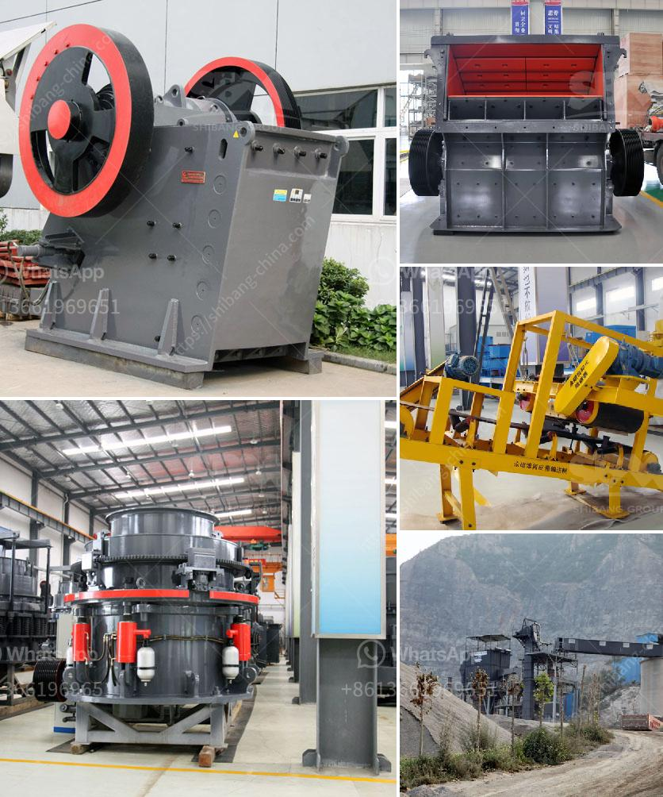

<h3>rock crushers for sale south africa</h3>
Rock crushers are a fundamental part of many industries, especially in the mining and construction industries. These machines are used to break large rocks into smaller, more manageable sizes and to separate rocks from unwanted materials. When looking for rock crushers for sale, South Africa is the best destination to find your desired machine.

South Africa is the country with rich mineral ores and we KEFID can supply the tungsten ore crusher, tin ore crusher, lead ore crusher silver ore crusher, as well as the associated basalt crusher. Basalt is a kind of crusher which is very hard. GEENGIZ ast has been adapted into new crusher equipment, which has been well received by the majority of users since its introduction.

The rock crushers are widely used in mining, building materials, chemical industry, and metallurgy and so on. They are suitable for primary and secondary crushing of all kinds of minerals and rocks with compressive strength less than 320 MPa. The crushers are robustly constructed for longer service life, reliability, and optimum performance.

When shopping around for rock crushers, it is crucial to consider factors such as the type of material to be crushed, the desired size of the finished product, and the capacity required. Additionally, it is important to choose a reliable supplier with a proven track record and excellent customer service.

South Africa offers a wide variety of rock crushers for sale, from jaw crushers to cone crushers and impact crushers. These machines are designed to reduce the size of rocks and ores, making them more manageable and easy to transport. With its huge population of potential buyers, it is also easy to find rock crushers for sale South Africa at competitive prices.

Whether you are in the mining industry, construction industry, or any other related industry, rock crushers are a key equipment for breaking down rocks into smaller sizes. With South Africa's abundance of mineral resources and its booming construction industry, rock crushers offer reliable, efficient, and cost-effective solutions for crushing operations.

In conclusion, rock crushers are an essential investment for any company involved in mining or construction. With South Africa's mineral-rich resources, coupled with the booming construction industry, rock crushers are widely used in many sectors, enhancing the overall productivity and profitability of businesses in the region. So, don't miss out on the opportunity to find high-quality rock crushers for sale South Africa.
<h3>Contact us</h3><ul><li><strong>Whatsapp:&nbsp;<a href="https://wa.me/8613661969651">+8613661969651</a></strong></li><li><a href="https://swt.shibang-china.com/?git&amp;zhl&amp;rock crushers for sale south africa"><strong>Online Service(chat now)</strong></a></li></ul><h3>Related</h3><ul><li><a href='different types of coal pulverizing ball mills.md'>different types of coal pulverizing ball mills</a></li><li><a href='ball mills in monterrey.md'>ball mills in monterrey</a></li><li><a href='stearic acid coating machine for calcium carbonate.md'>stearic acid coating machine for calcium carbonate</a></li><li><a href='belt conveyor design.md'>belt conveyor design</a></li><li><a href='crusher hammer material grade.md'>crusher hammer material grade</a></li></ul>