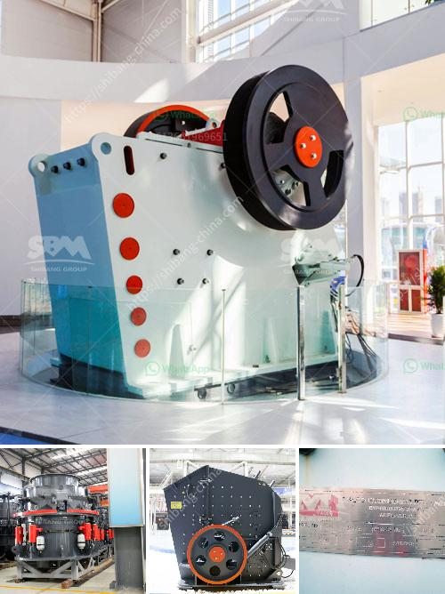

<h3>rock crushers in south africa</h3>
Rock crushers are a necessary tool for any mining or quarrying operation. Also known as stone crushers, they are used to break down rocks into smaller sizes or even into fine dust. Rocks are used for a variety of purposes, such as building materials, road construction, and landscaping. In South Africa, rock crushers are widely used in the mining sector as they are employed to reduce the size of large rocks to smaller rocks or gravel.

South Africa possesses a wealth of mineral resources and has extensive mining operations, including gold, platinum, coal, and diamonds. South Africa is also a leading producer of granite, porphyry, basalt, and sandstone. To meet the demands of these industries, rock crushers must be able to process a wide variety of rocks, including abrasive and hard materials.

One of the key benefits of using rock crushers is their ability to produce different sizes of final products. Rocks extracted from mines or quarries are often too large for immediate use, and crushing them into smaller, more manageable sizes is essential. Rock crushers enable mining operations to extract valuable minerals from the waste rock, which helps to maximize the overall operation's efficiency.

There are several different types of rock crushers available in South Africa that serve different purposes. Some rock crushers are designed to produce a specific size range, while others are designed to produce various sizes depending on the application. Jaw crushers are commonly used in the primary stage of crushing, where large rocks are initially broken down into smaller sized pieces. Cone crushers are typically used for secondary or tertiary crushing stages, where they are used to produce a fine product size. Impact crushers are also used for secondary crushing, but can produce a more cubical-shaped product compared to cone crushers.

The demand for rock crushers in South Africa is driven by factors such as the growing mining activities in the region and the increasing demand for aggregate material in the construction industry. However, the availability of skilled professionals to operate and maintain rock crushers can be a challenge. It is essential for companies to invest in training programs to ensure that operators have the necessary skills to operate the equipment safely and efficiently.

Furthermore, rock crushers require regular maintenance to ensure their optimal performance. This maintenance includes checking and replacing wear parts, such as crusher liners and blow bars, and conducting regular inspections to identify any potential issues. Regular maintenance routines can help prolong the lifespan of rock crushers and ensure their reliable performance.

In conclusion, rock crushers play a crucial role in the mining and quarrying industry in South Africa. They are necessary tools for breaking down rocks into smaller sizes, enabling the extraction of valuable minerals and maximizing overall operational efficiency. However, proper training and maintenance are essential to ensure the safe and efficient operation of rock crushers. With the increasing demand for minerals and construction materials, the use of rock crushers in South Africa is expected to continue to grow.
<h3>Contact us</h3><ul><li><strong>Whatsapp:&nbsp;<a href="https://wa.me/8613661969651">+8613661969651</a></strong></li><li><a href="https://swt.shibang-china.com/?git&amp;zhl&amp;rock crushers in south africa"><strong>Online Service(chat now)</strong></a></li></ul><h3>Related</h3><ul><li><a href='barytes processing equipment.md'>barytes processing equipment</a></li><li><a href='dust control for crushing plants.md'>dust control for crushing plants</a></li><li><a href='marble grinding machines factory in turkey.md'>marble grinding machines factory in turkey</a></li><li><a href='crusher manufacturer in china.md'>crusher manufacturer in china</a></li><li><a href='crusher plant germany.md'>crusher plant germany</a></li></ul>